# embedded-in-automotive
stm32f1, CAN, LIN, AUTOSAR
# LESSON 1: SET UP AND CREATE NEW PROJECTS IN KEILC
<details><summary>Details</summary>
<p>

</p>
</details>


# LESSON 2: GPIO
<details><summary>Details</summary>
<p>

## 1. Thư viện STM32F10x SPL (Standard Peripherals Library)
## 2. Lý thuyết về GPIO

GPIO-General Purpose Input/Output là các chân trên vi điều khiển có thể lập trình để truyền nhận tín 
hiệu với các thiết bị bên ngoài hoặc thực hiện các chức năng giao tiếp 
khác.
 
GPIO hoạt động ở các chế độ sau:

### GPIO Intput

Ở chế độ này, chân GPIO được sử dụng để nhận tín hiệu từ bên ngoài vào vi điều khiển.

Các loại Input Mode:

 - **Floating hay High-impedance (thả nổi)**: Chân GPIO không có trạng thái điện áp xác định khi không có tín hiệu vào. 

    Ví dụ:

    Mắc một nút nhấn theo kiểu Floating như hình, khi không nhấn nút thì không có tín hiệu vào.

    Khi nhấn nút, VĐK nhận tín hiệu tùy vào chân còn lại của nút nhấn mắc với Vcc hay Gnd (trong hình là Gnd, VĐK nhận mức thấp (0)).

    <p align="center">
        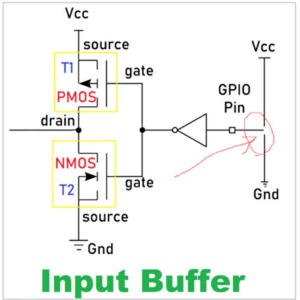
    </p>

    _Không nên sử dụng mode này! Dễ bị nhiễu lúc không có tín hiệu và tốn năng lượng_

 - **Pull-up (điện trở kéo lên)**: Chân GPIO ở mức cao khi không có tín hiệu đầu vào.
    
    Ví dụ: 
    
    Mắc một nút nhấn theo kiểu pull-up như hình, khi không nhấn nút thì PMOS dẫn, VĐK sẽ nhận mức cao (1).
    <p align="center">
        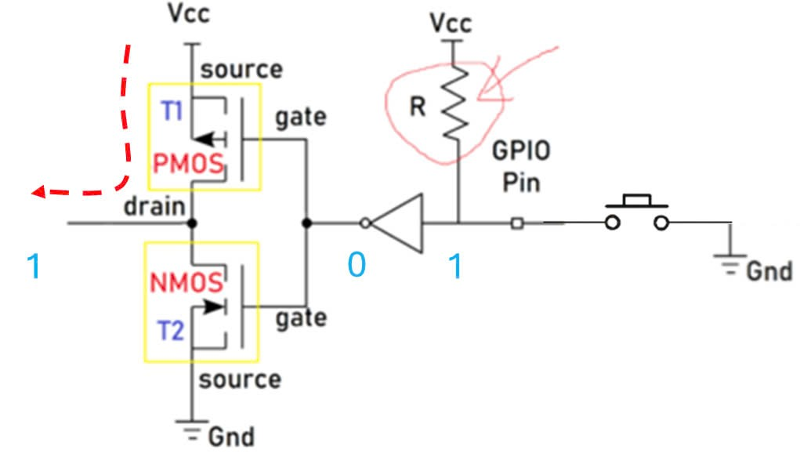
    </p>

    Ngược lại khi nhấn nút, NMOS dẫn thì VĐK nhận mức thấp (0).
    <p align="center">
        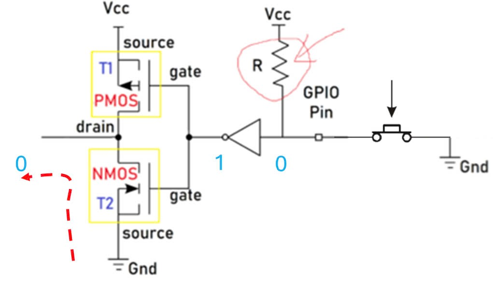
    </p>

 - **Pull-down (điện trở kéo xuống)**: Chân GPIO ở mức thấp khi không có tín hiệu đầu vào.
    
    Ví dụ: 

    Mắc một nút nhấn theo kiểu pull-down như hình, khi không nhấn nút thì NMOS dẫn, VĐK sẽ nhận mức thấp (0).

    <p align="center">
        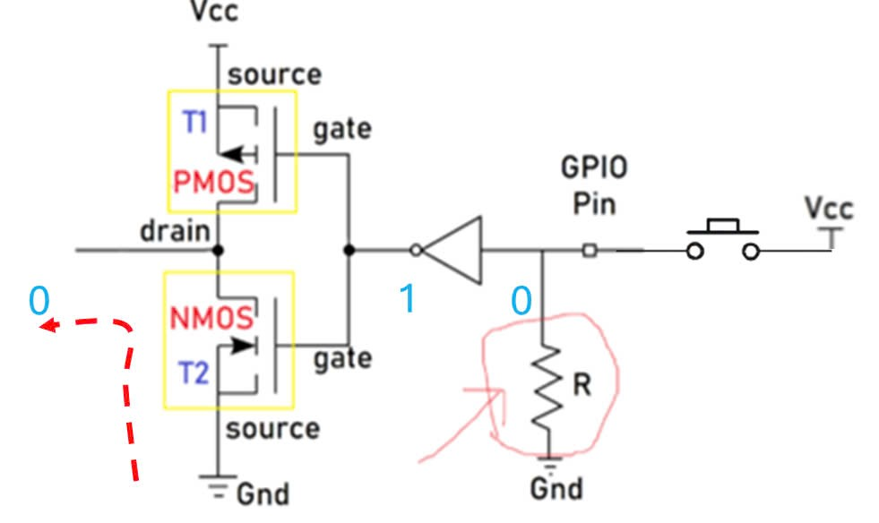
    </p>

    Ngược lại khi nhấn nút, PMOS dẫn thì VĐK nhận mức cao (1).
    <p align="center">
        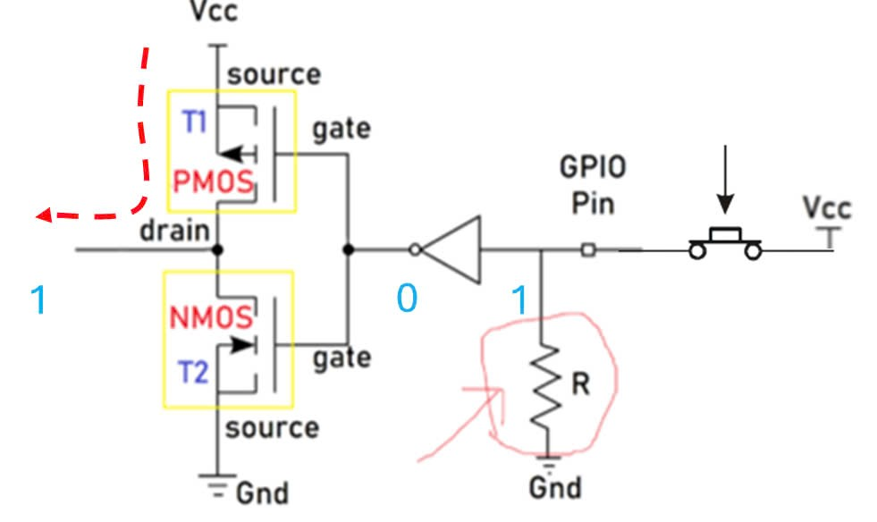
    </p>

### GPIO Input

Ở chế độ này, chân GPIO được sử dụng để xuất tín hiệu ra bên ngoài từ vi điều khiển.

Các loại Output Mode:

 - Push-Pull: Chân GPIO xuất ra có thể là mức cao (1) hoặc mức thấp (0).

    Ví dụ:

    Khi VĐK xuất mức cao (1), PMOS dẫn và chân GPIO sẽ ở mức cao (1).
    <p align="center">
        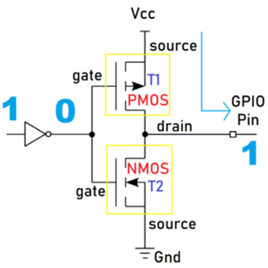
    </p>

    Ngược lại, VĐK xuất mức thấp (0), NMOS dẫn và chân GPIO sẽ ở mức thấp (0).
    <p align="center">
        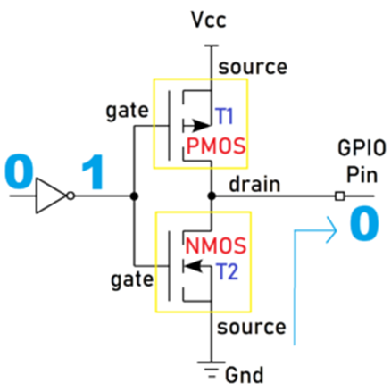
    </p>

 - Open-Drain: Chân GPIO chỉ  có thể xuất ra mức thấp (0) hoặc ở trạng thái "thả nổi".

    Ví dụ:

    Khi ở mode Open-Drain thì Output Buffer chỉ còn lại một NMOS.

    Khi VĐK xuất mức cao (1), NMOS không dẫn và chân GPIO sẽ thả nổi.
    
    Khi VĐK xuất mức thấp (0), NMOS dẫn và chân GPIO sẽ ở mức thấp (0).

    <p align="center">
        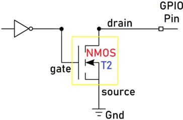
    </p>

    _Nếu VĐK dùng mosfet thì gọi là Open-Drain, còn nếu dùng BJT gọi là Open-Collector._

### Analog

Ở chế độ này, chân GPIO kết nối với bộ chuyển đổi ADC (analog-to-digital converter) bên trong và cho phép đọc một giá trị đại diện cho điện áp trên chân đó. 

Giá trị này phụ thuộc vào độ phân giải của ADC. 

Ví dụ: ADC 12-bit có thể có các giá trị từ 0 đến 4095. Giá trị này được ánh xạ tới một điện áp nằm trong khoảng từ 0V đến điện áp mà vi điều khiển đang hoạt động (ví dụ, 3.3V). 

Khi một GPIO được cấu hình ở chế độ analog, các điện trở kéo lên/kéo xuống đầu vào sẽ bị vô hiệu (thả nổi).

_Sẽ học kĩ hơn ở bài ADC._

### Alternate Function

Ngoài ba chế độ trên, các chân GPIO còn có thể cung cấp các chức năng thay thế.

Ví dụ các chức năng thay thế: chân Rx/Tx cho giao tiếp UART, chân SDA/SCL cho giao tiếp I2C, v.v.

Để cấu hình cho chức năng thay thế, ta phải tác động lên các thanh ghi cụ thể, sẽ học kĩ hơn ở các bài sau.

## 3. Lập trình với GPIO

Để sử dụng một ngoại vi bất kì phải trải qua các bước sau:

<p align="center">
    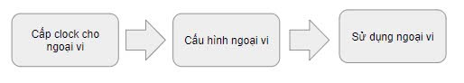
</p>

Như các thư viện khác (HAL, LL, CMSIS,...), SPL cung cấp các hàm và các định nghĩa giúp việc cấu hình và sử dụng ngoại vi.

### Cấp xung clock cho GPIO

STM32 sử dụng các bus (như AHB, APB1, APB2) để giao tiếp với các ngoại vi như GPIO, UART, I2C, SPI, v.v.

Để sử dụng các ngoại vi này, trước tiên, cần cấp xung (clock) cho bus tương ứng thông qua việc sử dụng các API trong thư viện.

Tra thông tin clock trong Reference (trang 92) và Data sheet (trang 11) để biết được bus nào cần được cấp xung.

<p align="center">
    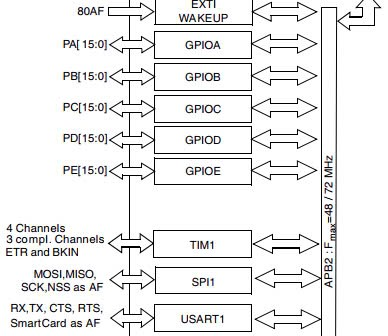
</p>

Trong SPL, để bật xung clock cho ngoại vi GPIO:

```c
void RCC_Config(){
	RCC_APB2PeriphClockCmd(RCC_APB2Periph_GPIOC, ENABLE);
} 
```
 - Tham số thứ 1 là ngoại vi cần cấu hình clock. 

 - Tham số thứ 2 là giá trị quy định cấp (ENABLE) hay ngưng (DISABLE) xung clock cho ngoại vi đó.

### Cấu hình GPIO

Để cấu hình cho chân GPIO:
```c
void GPIO_Config(){
	GPIO_InitTypeDef GPIO_InitStructure;
	GPIO_InitStructure.GPIO_Pin = GPIO_Pin_13 | GPIO_Pin_14;
	GPIO_InitStructure.GPIO_Mode = GPIO_Mode_Out_PP;
	GPIO_InitStructure.GPIO_Speed = GPIO_Speed_50MHz;
	
	GPIO_Init(GPIOC, &GPIO_InitStructure);
}
```
Việc cấu hình GPIO được thực hiện thông qua việc khai báo và sử dụng struct `GPIO_InitTypeDef`, trong đó chứa các tham số cấu hình cho một chân GPIO cụ thể:

 - **GPIO_Pin**: Xác định chân hoặc các chân GPIO muốn cấu hình bằng cách sử dụng các macro như `GPIO_Pin_0`, `GPIO_Pin_1`,... hoặc kết hợp các chân bằng toán tử OR `|` nếu muốn cấu hình nhiều chân cùng lúc.

    <p align="center">
        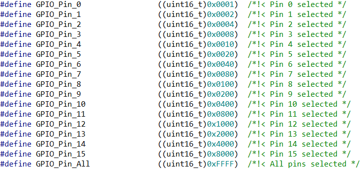
    </p>

 - **GPIO_Mode**: Xác định mode hoạt động của chân GPIO.

    <p align="center">
        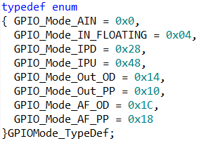
    </p>

 - **GPIO_Speed**: Chọn tốc độ đáp ứng của chân GPIO.

    <p align="center">
        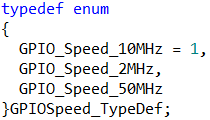
    </p>

Hàm khởi tạo GPIO_Init() nhận 2 tham số: 
 - GPIO_TypeDef: Chỉ định cổng GPIO muốn cấu hình (ví dụ: `GPIOA`, `GPIOB`, `GPIOC`,...).
 - &GPIO_InitStruct: Con trỏ đến biến cấu trúc `GPIO_InitTypeDef` chứa các thông số cấu hình.

### Sử dụng GPIO

Một số hàm thao tác với GPIO:

 - Đọc giá trị mức logic (0 hoặc 1) của một chân Input/Output cụ thể trên cổng GPIO.
    ```C
    uint8_t GPIO_ReadInputDataBit(GPIO_TypeDef* GPIOx, uint16_t GPIO_Pin);
    uint8_t GPIO_ReadOutputDataBit(GPIO_TypeDef* GPIOx, uint16_t GPIO_Pin);
    ```
 - Đọc toàn bộ giá trị đầu vào/ra của một cổng GPIO.

    _Giá trị trả về 16-bit, mỗi bit tương ứng với trạng thái của từng chân của cổng._

    ```C
    uint16_t GPIO_ReadInputData(GPIO_TypeDef* GPIOx);
    uint16_t GPIO_ReadOutputData(GPIO_TypeDef* GPIOx);
    ```
 - Đặt mức cao (1) / thấp (0) cho một hoặc nhiều chân output sử dụng OR `|` trên một cổng GPIO.

    ```C
    void GPIO_SetBits(GPIO_TypeDef* GPIOx, uint16_t GPIO_Pin);
    void GPIO_ResetBits(GPIO_TypeDef* GPIOx, uint16_t GPIO_Pin);
    ```
 - Ghi mức logic cụ thể (0 hoặc 1) cho một chân output.

    ```C
    void GPIO_WriteBit(GPIO_TypeDef* GPIOx, uint16_t GPIO_Pin, BitAction BitVal);
    ```

 - Ghi một giá trị 16-bit trực tiếp cho toàn bộ cổng GPIO, trong đó mỗi bit đại diện cho trạng thái của một chân.
    
    ```C
    void GPIO_Write(GPIO_TypeDef* GPIOx, uint16_t PortVal);
    ```
## 4. Bài tập (Xem trong folder: lesson-2-GPIO)

</p>
</details>

# LESSON 12: CAN(THEORY)
<details><summary>Details</summary>
<p>

## 1. Giao thức CAN 

Giao thức CAN (Controller Area Network) là một giao thức truyền thông phổ biến trong các hệ thống nhúng, đặc biệt là trong lĩnh vực ô tô.

CAN hỗ trợ mạnh cho những hệ thống điều khiển thời gian thực phân bố (distributed real-time control system).

**Distributed real-time control system:** Sẽ gồm nhiều khối thiết bị phân bố trên nhiều nơi trong hệ thống, giao tiếp với nhau thông qua CAN Bus trong thời gian thực.

<p align="center">
    
</p>

## 2. Mạng CAN

CAN sử dụng kiến trúc **bus topology**, tất cả các thiết bị đều được kết nối song song vào một cặp dây truyền thông chung được gọi là **CAN Bus** tạo thành **mạng CAN**.

## 3. CAN Node

Mỗi thiết bị trên mạng CAN được gọi là một **node**.

<p align="center">
    
</p>

Các node nếu muốn gửi và nhận dữ liệu CAN thì bên trong các node cần có những thành phần sau:

 - **Vi điều khiển (Microcontroller)**: là thành phần trung tâm điều khiển hoạt động của node CAN.

    + Đọc và xử lý thông điệp CAN.
    + Tạo ra thông điệp CAN để truyền đi.
	+ Quản lý các khung dữ liệu, bit arbitration và quá trình xử lý lỗi.
	+ Điều khiển hành vi của node (Ví dụ: bật/tắt node, reset node khi gặp lỗi bus-off).

 - **CAN Controller**: Đây là thành phần được tích hợp bên trong VĐK, có nhiệm vụ xử lý toàn bộ giao tiếp CAN.
	+ Gửi và nhận thông điệp CAN.
	+ Điều khiển truy cập vào bus CAN (arbitration).
	+ Phát hiện và xử lý các lỗi truyền thông CAN.
	+ Kiểm soát việc truyền lại thông điệp khi gặp lỗi.
	+ Cung cấp giao diện giữa các VĐK và bus CAN.

 - **CAN Transceiver**:
    + Chuyển đổi tín hiệu số từ bộ điều khiển CAN thành tín hiệu điện áp dạng differential (CANH và CANL) để gửi lên bus CAN và ngược lại.
    + Đảm bảo tín hiệu truyền và nhận trên bus CAN có độ chính xác và tốc độ cao.

    <p align="center">
        
    </p>

 - **Cảm biến (Sensor), cơ cấu chấp hành (Actuator)**:
    + Nhiệt độ, áp suất lốp, tốc độ,...
    + Mở cốp, điều khiển động cơ, bật đèn,...

## 4. CAN Bus

CAN Bus gồm hai dây tín hiệu chính: CAN_H (CAN High) và CAN_L (CAN Low). 

Các tín hiệu truyền qua bus CAN là tín hiệu vi sai, cụ thể là chênh lệch điện áp trên cặp dây tín hiệu.

<p align="center">
    
</p>

Vì tính chất vi sai trên đường truyền tín hiệu của bus CAN, tín hiệu nhiễu sẽ ảnh hưởng đến giá trị điện áp.

CAN bus thường được xoắn 2 dây vào nhau để triệt tiêu nhiễu.

## 5. Dominant và Recessive

Bus CAN định nghĩa hai trạng thái điện áp là: Dominant và Recessive. Tương đương với bit 0 và 1 của các giao thức khác. 

Hai trạng thái này sẽ được xử lý bởi Transceiver của Node. 

Theo tốc độ truyền nhận CAN, ta chia làm hai loại: CAN low speed và CAN high speed. Tương ứng với các giá trị điện áp khác nhau.

 - CAN low speed:
    + Bit Dominant: CAN_H = 4V, CAN_L = 1V.
    + Bit Recessive: CAN_H = 1.75V, CAN_L = 3.25V. 
    <p align="center">
        
    </p>

 - CAN high speed:
    + Bit Dominant: CAN_H = 3.5V, CAN_H = 1.5V.
    + Bit Recessive: CAN_H = CAN_L = 2.5V. 
<p align="center">
    
</p>

## 5. Các đặc điểm của giao thức CAN 
**Phần này quan trọng!**
### Không tuân theo kiến trúc Master-Slave: 

Tất cả các thiết bị trên bus đều có quyền ngang nhau trong việc truyền dữ liệu mà không cần phải có thiết bị chủ điều khiển. 

Điều này cho phép mạng hoạt động linh hoạt hơn, khi bất kỳ node nào cũng có thể truyền hoặc nhận thông tin bất cứ lúc nào.


### Quá trình Arbitration 

Tất cả các node trong mạng CAN đều có quyền bắt đầu truyền dữ liệu cùng lúc, nghĩa là chúng có thể bắt đầu phát tín hiệu trên bus mà không cần phải đợi lần lượt. 

Tuy nhiên, đây là chỉ là bước bắt đầu quá trình truyền, và chỉ một node thực sự có thể truyền dữ liệu cuối cùng sau **quá trình Arbitration**:

 - Mỗi thông điệp CAN có một **ID ưu tiên**. Node nào có thông điệp với giá trị ID càng bé thì được độ ưu tiên cao hơn và sẽ chiếm quyền truy cập bus và gửi thông điệp trước.

 - Những node khác có giá trị ID lớn hơn sẽ tự động dừng lại và chờ lượt tiếp theo để gửi thông điệp.

    **Ví dụ: Chọn CAN low speed, có 3 node tham gia gửi.**

    Lưu ý: ID Node-2 > ID Node-1 > ID Node-3 (0x676 > 0x65D > 0x659)

    Đoạn giải thích dưới đây nhằm xoáy sâu vào luận điểm "ID càng bé thì ưu tiên càng cao", thực chất chỉ là kiểm tra từng bit theo giá trị binary, bit ID là Dominant sẽ được ưu tiên hơn.

    <p align="center">
    
    </p>

    + Quá trình Arbitration sẽ lần lượt kiểm tra từng bit ID từ MSB tới LSB.
    + Khi đến bit thứ 5, phát hiện bit thứ 5 của ID Node-2 là Recessive nên Node-2 vào hàng chờ và chỉ nghe.
    + Và nếu kiểm tra tiếp thì đến bit thứ 3, phát hiện bit thứ 3 của ID Node-1 là Recessive nên Node-1 tiếp tục vào hàng chờ và chỉ nghe.
    + Node-3 thắng và sẽ được gửi.

 - Quá trình Arbitration diễn ra mà không gây mất dữ liệu hay làm gián đoạn các thiết bị khác, vì thế mạng CAN là một hệ thống non-destructive (không gây mất dữ liệu).

### Broadcast Communication

Khi một node được chọn để gửi thông điệp, thông điệp đó sẽ được gửi đến tất cả các node khác trên bus. 

Tuy nhiên, không phải tất cả các node đều xử lý thông điệp này. Mỗi node sẽ sử dụng bộ lọc để kiểm tra xem thông điệp có phù hợp với mình hay không.

### Giao tiếp song công (Full-duplex Communication)
Mặc dù chỉ sử dụng một bus với hai dây tín hiệu, mạng CAN vẫn cho phép các node vừa gửi vừa nhận dữ liệu đồng thời. Điều này giúp mạng CAN hoạt động hiệu quả và không bị nghẽn khi có nhiều thiết bị cùng giao tiếp.

### Phát hiện và xử lý lỗi tự động

Một tính năng quan trọng khác của mạng CAN là khả năng tự động phát hiện và xử lý lỗi. Nếu một node phát hiện ra lỗi trong quá trình truyền hoặc nhận dữ liệu (do nhiễu, mất gói, hoặc lỗi tín hiệu), node đó sẽ gửi một Error Frame để thông báo cho các node khác rằng dữ liệu bị lỗi. Sau đó, thông điệp sẽ được truyền lại.

## 6. CAN Frame
**Phần này quan trọng!**

Dữ liệu CAN được truyền dưới dạng các Frame (khung). Một khung có dạng chung như sau:


</p>
</details>