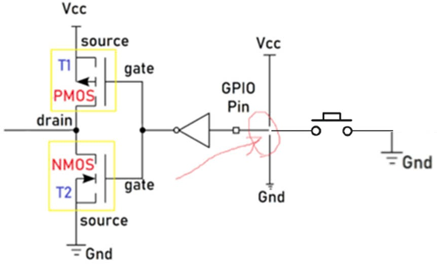
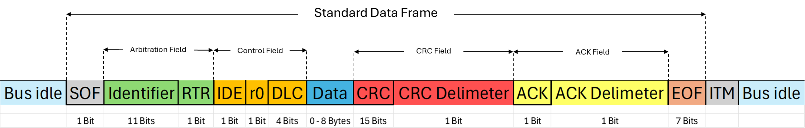
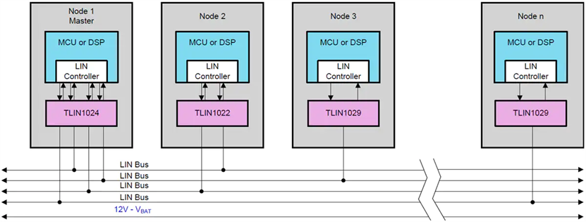
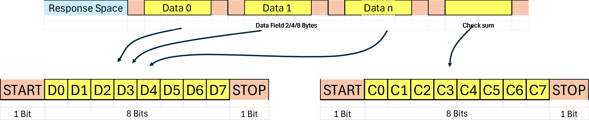

# LESSON 01: SET UP AND CREATE NEW PROJECTS IN KEILC
<details><summary>Details</summary>
<p>

</p>
</details>

# LESSON 02: GPIO
<details><summary>Details</summary>
<p>

## 1. Thư viện STM32F10x SPL (Standard Peripherals Library)
## 2. Lý thuyết về GPIO

GPIO-General Purpose Input/Output là các chân trên vi điều khiển có thể lập trình để truyền nhận tín 
hiệu với các thiết bị bên ngoài hoặc thực hiện các chức năng giao tiếp 
khác.
 
GPIO hoạt động ở các chế độ sau:

### GPIO Intput

Ở chế độ này, chân GPIO được sử dụng để nhận tín hiệu từ bên ngoài vào vi điều khiển.

Các loại Input Mode:

 - **Floating hay High-impedance (thả nổi)**: Chân GPIO không có trạng thái điện áp xác định khi không có tín hiệu vào. 

    Ví dụ:

    Mắc một nút nhấn theo kiểu Floating như hình, khi không nhấn nút thì không có tín hiệu vào.

    Khi nhấn nút, VĐK nhận tín hiệu tùy vào chân còn lại của nút nhấn mắc với Vcc hay Gnd (trong hình là Gnd, VĐK nhận mức thấp (0)).

    <p align="center">
        
    </p>

    _Không nên sử dụng mode này! Dễ bị nhiễu lúc không có tín hiệu và tốn năng lượng_

 - **Pull-up (điện trở kéo lên)**: Chân GPIO ở mức cao khi không có tín hiệu đầu vào.
    
    Ví dụ: 
    
    Mắc một nút nhấn theo kiểu pull-up như hình, khi không nhấn nút thì PMOS dẫn, VĐK sẽ nhận mức cao (1).
    <p align="center">
        
    </p>

    Ngược lại khi nhấn nút, NMOS dẫn thì VĐK nhận mức thấp (0).
    <p align="center">
        
    </p>

 - **Pull-down (điện trở kéo xuống)**: Chân GPIO ở mức thấp khi không có tín hiệu đầu vào.
    
    Ví dụ: 

    Mắc một nút nhấn theo kiểu pull-down như hình, khi không nhấn nút thì NMOS dẫn, VĐK sẽ nhận mức thấp (0).

    <p align="center">
        
    </p>

    Ngược lại khi nhấn nút, PMOS dẫn thì VĐK nhận mức cao (1).
    <p align="center">
        
    </p>

### GPIO Input

Ở chế độ này, chân GPIO được sử dụng để xuất tín hiệu ra bên ngoài từ vi điều khiển.

Các loại Output Mode:

 - Push-Pull: Chân GPIO xuất ra có thể là mức cao (1) hoặc mức thấp (0).

    Ví dụ:

    Khi VĐK xuất mức cao (1), PMOS dẫn và chân GPIO sẽ ở mức cao (1).
    <p align="center">
        
    </p>

    Ngược lại, VĐK xuất mức thấp (0), NMOS dẫn và chân GPIO sẽ ở mức thấp (0).
    <p align="center">
        
    </p>

 - Open-Drain: Chân GPIO chỉ  có thể xuất ra mức thấp (0) hoặc ở trạng thái "thả nổi".

    Ví dụ:

    Khi ở mode Open-Drain thì Output Buffer chỉ còn lại một NMOS.

    Khi VĐK xuất mức cao (1), NMOS không dẫn và chân GPIO sẽ thả nổi.
    
    Khi VĐK xuất mức thấp (0), NMOS dẫn và chân GPIO sẽ ở mức thấp (0).

    <p align="center">
        
    </p>

    _Nếu VĐK dùng mosfet thì gọi là Open-Drain, còn nếu dùng BJT gọi là Open-Collector._

### Analog

Ở chế độ này, chân GPIO kết nối với bộ chuyển đổi ADC (analog-to-digital converter) bên trong và cho phép đọc một giá trị đại diện cho điện áp trên chân đó. 

Giá trị này phụ thuộc vào độ phân giải của ADC. 

Ví dụ: ADC 12-bit có thể có các giá trị từ 0 đến 4095. Giá trị này được ánh xạ tới một điện áp nằm trong khoảng từ 0V đến điện áp mà vi điều khiển đang hoạt động (ví dụ, 3.3V). 

Khi một GPIO được cấu hình ở chế độ analog, các điện trở kéo lên/kéo xuống đầu vào sẽ bị vô hiệu (thả nổi).

_Sẽ học kĩ hơn ở bài ADC._

### Alternate Function

Ngoài ba chế độ trên, các chân GPIO còn có thể cung cấp các chức năng thay thế.

Ví dụ các chức năng thay thế: chân Rx/Tx cho giao tiếp UART, chân SDA/SCL cho giao tiếp I2C, v.v.

Để cấu hình cho chức năng thay thế, ta phải tác động lên các thanh ghi cụ thể, sẽ học kĩ hơn ở các bài sau.

## 3. Lập trình với GPIO

Để sử dụng một ngoại vi bất kì phải trải qua các bước sau:

<p align="center">
    
</p>

Như các thư viện khác (HAL, LL, CMSIS,...), SPL cung cấp các hàm và các định nghĩa giúp việc cấu hình và sử dụng ngoại vi.

### Cấp xung clock cho GPIO

STM32 sử dụng các bus (như AHB, APB1, APB2) để giao tiếp với các ngoại vi như GPIO, UART, I2C, SPI, v.v.

Để sử dụng các ngoại vi này, trước tiên, cần cấp xung (clock) cho bus tương ứng thông qua việc sử dụng các API trong thư viện.

Tra thông tin clock trong Reference (trang 92) và Data sheet (trang 11) để biết được bus nào cần được cấp xung.

<p align="center">
    
</p>

Trong SPL, để bật xung clock cho ngoại vi GPIO:

```c
void RCC_Config(){
	RCC_APB2PeriphClockCmd(RCC_APB2Periph_GPIOC, ENABLE);
} 
```
 - Tham số thứ 1 là ngoại vi cần cấu hình clock. 

 - Tham số thứ 2 là giá trị quy định cấp (ENABLE) hay ngưng (DISABLE) xung clock cho ngoại vi đó.

### Cấu hình GPIO

Để cấu hình cho chân GPIO:
```c
void GPIO_Config(){
	GPIO_InitTypeDef GPIO_InitStructure;
	GPIO_InitStructure.GPIO_Pin = GPIO_Pin_13 | GPIO_Pin_14;
	GPIO_InitStructure.GPIO_Mode = GPIO_Mode_Out_PP;
	GPIO_InitStructure.GPIO_Speed = GPIO_Speed_50MHz;
	
	GPIO_Init(GPIOC, &GPIO_InitStructure);
}
```
Việc cấu hình GPIO được thực hiện thông qua việc khai báo và sử dụng struct `GPIO_InitTypeDef`, trong đó chứa các tham số cấu hình cho một chân GPIO cụ thể:

 - **GPIO_Pin**: Xác định chân hoặc các chân GPIO muốn cấu hình bằng cách sử dụng các macro như `GPIO_Pin_0`, `GPIO_Pin_1`,... hoặc kết hợp các chân bằng toán tử OR `|` nếu muốn cấu hình nhiều chân cùng lúc.

    <p align="center">
        
    </p>

 - **GPIO_Mode**: Xác định mode hoạt động của chân GPIO.

    <p align="center">
        
    </p>

 - **GPIO_Speed**: Chọn tốc độ đáp ứng của chân GPIO.

    <p align="center">
        
    </p>

Hàm khởi tạo GPIO_Init() nhận 2 tham số: 
 - GPIO_TypeDef: Chỉ định cổng GPIO muốn cấu hình (ví dụ: `GPIOA`, `GPIOB`, `GPIOC`,...).
 - &GPIO_InitStruct: Con trỏ đến biến cấu trúc `GPIO_InitTypeDef` chứa các thông số cấu hình.

### Sử dụng GPIO

Một số hàm thao tác với GPIO:

 - Đọc giá trị mức logic (0 hoặc 1) của một chân Input/Output cụ thể trên cổng GPIO.
    ```C
    uint8_t GPIO_ReadInputDataBit(GPIO_TypeDef* GPIOx, uint16_t GPIO_Pin);
    uint8_t GPIO_ReadOutputDataBit(GPIO_TypeDef* GPIOx, uint16_t GPIO_Pin);
    ```
 - Đọc toàn bộ giá trị đầu vào/ra của một cổng GPIO.

    _Giá trị trả về 16-bit, mỗi bit tương ứng với trạng thái của từng chân của cổng._

    ```C
    uint16_t GPIO_ReadInputData(GPIO_TypeDef* GPIOx);
    uint16_t GPIO_ReadOutputData(GPIO_TypeDef* GPIOx);
    ```
 - Đặt mức cao (1) / thấp (0) cho một hoặc nhiều chân output sử dụng OR `|` trên một cổng GPIO.

    ```C
    void GPIO_SetBits(GPIO_TypeDef* GPIOx, uint16_t GPIO_Pin);
    void GPIO_ResetBits(GPIO_TypeDef* GPIOx, uint16_t GPIO_Pin);
    ```
 - Ghi mức logic cụ thể (0 hoặc 1) cho một chân output.

    ```C
    void GPIO_WriteBit(GPIO_TypeDef* GPIOx, uint16_t GPIO_Pin, BitAction BitVal);
    ```

 - Ghi một giá trị 16-bit trực tiếp cho toàn bộ cổng GPIO, trong đó mỗi bit đại diện cho trạng thái của một chân.
    
    ```C
    void GPIO_Write(GPIO_TypeDef* GPIOx, uint16_t PortVal);
    ```
## 4. Bài tập (Xem trong folder: lesson-2-GPIO)

</p>
</details>


# LESSON 3: INTERRUPTS AND TIMER
<details><summary>Details</summary>
<p>

</p>
</details>

# LESSON 04: CÁC CHUẨN GIAO TIẾP CƠ BẢN
<details><summary>Details</summary>
<p>

## 1. SPI

## Đặc điểm và cấu trúc vật lý

SPI là chuẩn giao tiếp nối tiếp, đồng bộ, cấu trúc Master - Slave, song công (truyền nhận cùng một lúc được), 4 dây.

<p align="center">
    
</p>

Bốn chân giao tiếp gồm:
 - SCK (Serial Clock): Master tạo xung tín hiệu SCK và cung cấp cho Slave.
 - MISO (Master Input Slave Output): Tín hiệu tạo bởi Slave và nhận bởi Master.
 - MOSI (Master Output Slave Input): Tín hiệu tạo bởi Master và nhận bởi Slave. 
 - SS (Đôi khi CS- Slave Select/Chip Select): Chọn Slave cụ thể để giao tiếp bằng cách xuất tín hiệu đường SS tương ứng xuống mức 0 (Low). 

## Quá trình truyền nhận


Bắt đầu quá trình, master sẽ kéo chân CS của slave muốn giao tiếp xuống 0 để báo hiệu muốn truyền nhận.
Clock sẽ được cấp bởi master, tùy vào chế độ được cài, với mỗi xungc clock,  1 bit sẽ được truyền từ master đến slave và slave cũng truyền 1 bit cho master.
Các thanh ghi cập nhật giá trị và dịch 1 bit.
Lặp lại quá trình trên đến khi truyền xong 8 bit trong thanh ghi.
Giao tiếp song công.

## Các chế độ hoạt động

## 2. I2C
## Đặc điểm và cấu trúc vật lý

I2C là chuẩn giao tiếp nối tiếp, đồng bộ, cấu trúc Master - Slave, bán song công (chỉ truyền hoặc nhận tại một thời điểm), 2 dây.

## Quá trình truyền nhận
## Các chế độ hoạt động


## 2. UART
## Đặc điểm và cấu trúc vật lý

UART là chuẩn giao tiếp nối tiếp, không đồng bộ, song công, 2 dây


## Quá trình truyền nhận
## Các chế độ hoạt động

</p>
</details>


# LESSON 05: SPI SOFTWARE & SPI HARDWARE
<details><summary>Details</summary>
<p>

## 1. SPI Software

SPI Software là tự tự lập trình cách thức giao tiếp bằng cách điều khiển các chân GPIO để tạo ra các tín hiệu SPI, và có thể sử dụng thêm Timer để quản lý nhịp.

Kém linh hoạt và chậm hơn so với SPI Hardware, ít sử dụng.

_Code SPI Software cho master và slave để ở trong folder lesson-05._

### Xác định và cấu hình chân GPIO

Chọn chân GPIO làm 4 chân SCK, MISO, MOSI, CS.

```c
#define SPI_SCK_Pin  GPIO_Pin_0
#define SPI_MISO_Pin GPIO_Pin_1
#define SPI_MOSI_Pin GPIO_Pin_2
#define SPI_CS_Pin   GPIO_Pin_3
#define SPI_GPIO     GPIOA
#define SPI_RCC      RCC_APB2Periph_GPIOA

void RCC_Config()
{
    // Enable clock for GPIO, Timer 2
    RCC_APB2PeriphClockCmd(SPI_RCC, ENABLE);
    RCC_APB1PeriphClockCmd(RCC_APB1Periph_TIM2, ENABLE);
}
```

Cấu hình chân cho:

- Master: SPI_SCK_Pin, SPI_MOSI_Pin, SPI_CS_Pin là **output push-pull**, SPI_MISO_Pin là **input floating**.

- Slave: SPI_SCK_Pin, SPI_MOSI_Pin, SPI_CS_Pin là **input floating**, SPI_MISO_Pin là **output push-pull**.

```c
void GPIO_Config()
{
    // Configure for MASTER
    GPIO_InitTypeDef GPIO_InitStructure;

    // Configure SCK, MOSI, and CS as output push-pull
    GPIO_InitStructure.GPIO_Pin = SPI_SCK_Pin | SPI_MOSI_Pin | SPI_CS_Pin;
    GPIO_InitStructure.GPIO_Mode = GPIO_Mode_Out_PP;
    GPIO_InitStructure.GPIO_Speed = GPIO_Speed_50MHz;
    GPIO_Init(SPI_GPIO, &GPIO_InitStructure);

    // Configure MISO as input floating
    GPIO_InitStructure.GPIO_Pin = SPI_MISO_Pin;
    GPIO_InitStructure.GPIO_Mode = GPIO_Mode_IN_FLOATING;
    GPIO_InitStructure.GPIO_Speed = GPIO_Speed_50MHz;
    GPIO_Init(SPI_GPIO, &GPIO_InitStructure);

    
    /*// Configure for SLAVE
    GPIO_InitTypeDef GPIO_InitStructure;

    // Configure SCK, MOSI, and CS as input floating
    GPIO_InitStructure.GPIO_Pin = SPI_SCK_Pin | SPI_MOSI_Pin | SPI_CS_Pin;
    GPIO_InitStructure.GPIO_Mode = GPIO_Mode_IN_FLOATING;
    GPIO_InitStructure.GPIO_Speed = GPIO_Speed_50MHz;
    GPIO_Init(SPI_GPIO, &GPIO_InitStructure);

    // Configure MISO as output push-pull
    GPIO_InitStructure.GPIO_Pin = SPI_MISO_Pin;
    GPIO_InitStructure.GPIO_Mode = GPIO_Mode_Out_PP;
    GPIO_InitStructure.GPIO_Speed = GPIO_Speed_50MHz;
    GPIO_Init(SPI_GPIO, &GPIO_InitStructure);
    */
}
```

### Tạo clock 

```c
void Clock(){
    GPIO_WriteBit(SPI_GPIO, SPI_SCK_Pin, Bit_SET);
    delay_ms(4);
    GPIO_WriteBit(SPI_GPIO, SPI_SCK_Pin, Bit_RESET);
    delay_ms(4);
}
```
### Set trạng thái ban đầu

```c
void SPI_Config()
{
    GPIO_WriteBit(SPI_GPIO, SPI_SCK_Pin, Bit_RESET);
    GPIO_WriteBit(SPI_GPIO, SPI_CS_Pin, Bit_SET);
    GPIO_WriteBit(SPI_GPIO, SPI_MISO_Pin, Bit_RESET);
    GPIO_WriteBit(SPI_GPIO, SPI_MOSI_Pin, Bit_RESET);
}
```


### Hàm truyền

Hàm truyền sẽ truyền lần lượt 8 bit trong byte dữ liệu:

 -Kéo CS xuống 0.

 -Truyền 1 bit.

 -Dịch 1 bit.

 -Gửi clock();

 -Kéo CS lên 1;

```c
void SPI_Master_Transmit(uint8_t u8Data)
{                          // 0b10010000
    uint8_t u8Mask = 0x80; // 0b10000000
    uint8_t tempData;
	
    GPIO_WriteBit(SPI_GPIO, SPI_CS_Pin, Bit_RESET);
    Delay_Ms(1);
	
    for (int i = 0; i < 8; i++)
    {
        tempData = u8Data & u8Mask;
        if (tempData)
        {
            GPIO_WriteBit(SPI_GPIO, SPI_MOSI_Pin, Bit_SET);
            Delay_Ms(1);
        }
        else
        {
            GPIO_WriteBit(SPI_GPIO, SPI_MOSI_Pin, Bit_RESET);
            Delay_Ms(1);
        }
        u8Data = u8Data << 1;
        Clock();
    }
    GPIO_WriteBit(SPI_GPIO, SPI_CS_Pin, Bit_SET);
    Delay_Ms(1);
}
```

### Hàm nhận

Hàm truyền sẽ truyền lần lượt 8 bit trong byte dữ liệu:

 -Kiểm tra CS ==0?.

 -Kiểm tra Clock==1?

 -Đọc data trên MOSI, ghi vào biến.

 -Dịch 1 bit.

 -Kiểm tra CS==1?

```c
uint8_t SPI_Slave_Receive(void)
{
    uint8_t dataReceive = 0x00; // 0b11000000
    uint8_t temp = 0x00, i = 0;

    while (GPIO_ReadInputDataBit(SPI_GPIO, SPI_CS_Pin));

    while (!GPIO_ReadInputDataBit(SPI_GPIO, SPI_SCK_Pin));

    for (i = 0; i < 8; i++)
    {
        if (GPIO_ReadInputDataBit(SPI_GPIO, SPI_SCK_Pin))
        {
            while (GPIO_ReadInputDataBit(SPI_GPIO, SPI_SCK_Pin))
			{
                temp = GPIO_ReadInputDataBit(SPI_GPIO, SPI_MOSI_Pin);
			}
            dataReceive = dataReceive << 1;
            dataReceive = dataReceive | temp;
        }
        while (!GPIO_ReadInputDataBit(SPI_GPIO, SPI_SCK_Pin));
    }
    return dataReceive;
}
```

### Truyền và nhận dữ liệu trong main

**Master truyền:**

```c
uint8_t DataTrans[] = {0,1,2,3,4,5,6,7,8,9};

int main()
{
    RCC_Config();
    GPIO_Config();
    TIM_Config();
    SPI_Config();

    while (1)
    {
		// Send 0 to 9
		for (uint8_t i = 0; i < 10; i++) 
		{
			SPI_Master_Transmit(DataTrans[i]); 
			Delay_Ms(500);           
		}
    }
}
```
**Slave nhận:**

```c
uint8_t Data;

int main()
{
    RCC_Config();
    GPIO_Config();
    TIM_Config();
    SPI_Config();

    while (1)
    {
        if (!(GPIO_ReadInputDataBit(SPI_GPIO, SPI_CS_Pin)))
        {
            for (int i = 0; i < 10; i++)
            {
				Data = SPI_Slave_Receive();
            }
        }
    }
}
```

## 2. SPI hardware
</p>
</details>

# LESSON 06: I2C
<details><summary>Details</summary>
<p>

## 1. I2C software
## 2. I2C hardware
</p>
</details>

# LESSON 07: UART
<details><summary>Details</summary>
<p>
## 1. UART software
## 2. UART hardware
</p>
</details>

# LESSON 08: EXTERNAL, TIMER, COMMUNICATION INTERRUPTS
<details><summary>Details</summary>
<p>
</p>
</details>

# LESSON 09: ADC
<details><summary>Details</summary>
<p>
</p>
</details>

# LESSON 10: DMA
<details><summary>Details</summary>
<p>
</p>
</details>

# LESSON 11: BOOTLOADER
<details><summary>Details</summary>
<p>
</p>
</details>

# LESSON 12: CAN - CONTROLLER AREA NETWORK
<details><summary>Details</summary>
<p>

## 1. Giao thức CAN 

CAN là một giao thức truyền thông phổ biến trong các hệ thống nhúng, đặc biệt là trong lĩnh vực ô tô.

CAN hỗ trợ mạnh cho những hệ thống điều khiển thời gian thực phân bố (distributed real-time control system).

<p align="center">
    
</p>

## 2. Mạng CAN

CAN sử dụng kiến trúc **bus topology**, tất cả các thiết bị đều được kết nối song song vào một cặp dây truyền thông chung được gọi là **CAN Bus** tạo thành **mạng CAN**.

## 3. CAN Node

Mỗi thiết bị trên mạng CAN được gọi là node.

<p align="center">
    
</p>

Thành phần trong một node:

 - **Vi điều khiển (Microcontroller)**: Điều khiển hoạt động của node CAN.

    + Đọc và xử lý thông điệp CAN.
    + Tạo ra thông điệp CAN để truyền đi.
	+ Quản lý các khung dữ liệu, bit arbitration và quá trình xử lý lỗi.
	+ Bật/tắt node, reset node khi gặp lỗi bus-off.

 - **CAN Controller**: Được tích hợp bên trong VĐK, có nhiệm vụ xử lý toàn bộ giao tiếp CAN.
	+ Gửi và nhận thông điệp CAN.
	+ Điều khiển truy cập vào bus CAN (arbitration).
	+ Phát hiện và xử lý các lỗi truyền thông CAN.
	+ Kiểm soát việc truyền lại thông điệp khi gặp lỗi.
	+ Cung cấp giao diện giữa các VĐK và bus CAN.

 - **CAN Transceiver**:
    + Chuyển đổi tín hiệu số từ bộ điều khiển CAN thành tín hiệu điện áp dạng differential (CANH và CANL) để gửi lên bus CAN và ngược lại.
    + Đảm bảo tín hiệu truyền và nhận trên bus CAN có độ chính xác và tốc độ cao.

    <p align="center">
        
    </p>

 - **Cảm biến (Sensor), cơ cấu chấp hành (Actuator)**:
    + Nhiệt độ, áp suất lốp, tốc độ,...
    + Mở cốp, điều khiển động cơ, bật đèn,...

## 4. CAN Bus

Gồm hai dây tín hiệu: CAN_H (CAN High) và CAN_L (CAN Low). 

Các tín hiệu truyền qua bus CAN là tín hiệu vi sai - chênh lệch điện áp trên hai dây.

<p align="center">
    
</p>

CAN bus thường được xoắn 2 dây vào nhau để triệt tiêu nhiễu.

## 5. Dominant và Recessive

Bus CAN định nghĩa hai trạng thái điện áp là: Dominant và Recessive. Tương đương với bit 0 và 1 của các giao thức khác. 

Hai trạng thái này sẽ được xử lý bởi Transceiver. 

Theo tốc độ truyền nhận CAN, ta chia làm hai loại: CAN low speed và CAN high speed. Tương ứng với các giá trị điện áp khác nhau.

 - CAN low speed:
    + Bit Dominant: CAN_H = 4V, CAN_L = 1V.
    + Bit Recessive: CAN_H = 1.75V, CAN_L = 3.25V. 
    <p align="center">
        
    </p>

 - CAN high speed:
    + Bit Dominant: CAN_H = 3.5V, CAN_H = 1.5V.
    + Bit Recessive: CAN_H = CAN_L = 2.5V. 
<p align="center">
    
</p>

## 5. Các đặc điểm của giao thức CAN 
**Phần này quan trọng!**
### Không tuân theo kiến trúc Master-Slave: 

Tất cả các thiết bị trên bus đều có quyền ngang nhau trong việc truyền dữ liệu mà không cần phải có thiết bị chủ điều khiển. 

Điều này cho phép mạng hoạt động linh hoạt hơn, khi bất kỳ node nào cũng có thể truyền hoặc nhận thông tin bất cứ lúc nào.


### Quá trình tranh chấp quyền gửi (Arbitration)

Tất cả các node trong mạng CAN đều có quyền bắt đầu truyền dữ liệu cùng lúc, nghĩa là chúng có thể bắt đầu phát tín hiệu trên bus mà không cần phải đợi lần lượt. 

Tuy nhiên, đây là chỉ là bước bắt đầu quá trình truyền, và chỉ một node thực sự có thể truyền dữ liệu cuối cùng sau **quá trình Arbitration**:

 - Mỗi thông điệp CAN có một **ID ưu tiên**. Node nào có thông điệp với giá trị ID càng bé thì được độ ưu tiên cao hơn và sẽ chiếm quyền truy cập bus và gửi thông điệp trước.

 - Những node khác có giá trị ID lớn hơn sẽ tự động dừng lại và chờ lượt tiếp theo để gửi thông điệp.

    **Ví dụ: Chọn CAN low speed, có 3 node tham gia gửi.**

    Lưu ý: ID Node-2 > ID Node-1 > ID Node-3 (0x676 > 0x65D > 0x659)

    Đoạn giải thích dưới đây nhằm xoáy sâu vào luận điểm "ID càng bé thì ưu tiên càng cao", thực chất chỉ là kiểm tra từng bit theo giá trị binary, bit ID là Dominant sẽ được ưu tiên hơn.

    <p align="center">
    
    </p>

    + Quá trình Arbitration sẽ lần lượt kiểm tra từng bit ID từ MSB tới LSB.
    + Khi đến bit thứ 5, phát hiện bit thứ 5 của ID Node-2 là Recessive nên Node-2 vào hàng chờ và chỉ nghe.
    + Và nếu kiểm tra tiếp thì đến bit thứ 3, phát hiện bit thứ 3 của ID Node-1 là Recessive nên Node-1 tiếp tục vào hàng chờ và chỉ nghe.
    + Node-3 thắng và sẽ được gửi.

 - Quá trình Arbitration diễn ra mà không gây mất dữ liệu hay làm gián đoạn các thiết bị khác, vì thế mạng CAN là một hệ thống non-destructive (không gây mất dữ liệu).

### Broadcast Communication

Khi một node được chọn để gửi thông điệp, thông điệp đó sẽ được gửi đến tất cả các node khác trên bus. 

### Giao tiếp song công (Full-duplex Communication)
Mặc dù chỉ sử dụng một bus với hai dây tín hiệu, mạng CAN vẫn cho phép các node vừa gửi vừa nhận dữ liệu đồng thời.

### Phát hiện và xử lý lỗi tự động

Nếu một node phát hiện ra lỗi trong quá trình truyền hoặc nhận dữ liệu (do nhiễu, mất gói, hoặc lỗi tín hiệu), node đó sẽ gửi một Error Frame để thông báo cho các node khác rằng dữ liệu bị lỗi. Sau đó, thông điệp sẽ được truyền lại.

## 6. Các phiên bản của CAN

Các phiên bản CAN bao gồm: CAN 2.0A (Standard CAN), CAN 2.0B (Extended CAN), và CAN FD (Flexible Data-rate).

## 7. CAN Frame
**Phần này quan trọng!**

_Chú thích: Frame (Khung), Field (Trường)._

Mạng CAN hỗ trợ: Data Frame, Remote Frame, Error Frame và Overload Frame.

### Data Frame

Dùng để truyền dữ liệu.

Có hai phiên bản Data Frame: Khung tiêu chuẩn (CAN 2.0A), khung mở rộng (CAN 2.0B).

**Khung tiêu chuẩn**:

<p align="center">
    
</p>

 - **S0F - Start Of Frame**: Luôn là Dominant, bắt đầu thông điệp. 

 - **Identifier**: Xác định mức độ ưu tiên.

 - **RTR - Remote Transmission Request**: Phân biệt Data Frame (=Dominant) và Remote Frame (=Recessive).

 - **IDE - Identifier Extension**: Phân biệt khung tiêu chuẩn (=Dominant) và khung mở rộng (=Recessive).

 - **r0**: Mặc định là Dominant, hiện tại không có chức năng cụ thể, không quan trọng.

 - **DLC - Data Length Code**: Giá trị (0 - 8 theo Binary) ứng với số byte dữ liệu.

 - **Data**: Dữ liệu.

 - **CRC - Cyclic Redundancy Check**: Kiểm tra lỗi thông điệp.

 - **CRC Delimiter**: Luôn là Recessive, dùng để ngăn cách.

 - **ACK - Acknowledge**: Để node nhận ghi vào sau khi kiểm tra lỗi ở CRC, không lỗi = Dominant và có lỗi = Recessive.

 - **ACK Delimiter**: Luôn là Recessive.

 - **EOF - End Of Frame**: 7 bits Recessive, kết thúc thông điệp.

**Khung mở rộng:**

<p align="center">
    
</p>

  - **S0F - Start Of Frame**: Luôn có giá trị Dominant, báo hiệu với các node một thông điệp mới đang bắt đầu. 

 - **Base Identifier**: xác định mức độ ưu tiên.

 - **SRR - Substitute Remote Request**: Độ dài 1 bit, chỉ có ở Extended Frame, giá trị luôn là Recessive.

 - **IDE - Identifier Extension**: Phân biệt khung tiêu chuẩn (=Dominant) và khung mở rộng (=Recessive).

 - **Extended Identifier**: ID mở rộng.

 - **RTR - Remote Transmission Request**: Phân biệt Data Frame (=Dominant) và Remote Frame (=Recessive).

 - **r1, r0**: Mặc định là Dominant, hiện tại không có chức năng cụ thể, không quan trọng.

 - **DLC - Data Length Code**: Giá trị (0 - 8 theo Binary) ứng với số byte dữ liệu.

 - **Data**: Dữ liệu.

 - **CRC - Cyclic Redundancy Check**: Kiểm tra lỗi thông điệp.

 - **CRC Delimiter**: Luôn là Recessive, dùng để ngăn cách.

 - **ACK - Acknowledge**: Để node nhận ghi vào sau khi kiểm tra lỗi ở CRC, không lỗi = Dominant và có lỗi = Recessive.

 - **ACK Delimiter**: Luôn là Recessive.

 - **EOF - End Of Frame**: 7 bits Recessive, kết thúc thông điệp.

### Remote Frame


### Error Frame

Được một node bất kì gửi đi khi phát hiện thông điệp mình vừa nhận không hợp lệ và phải gửi lại.

Error Frame gồm hai phần: 
 - Error Flag là chuỗi từ 6 đến 12 bit dominant, báo hiệu lỗi. 
 - Error Delimiter là chuỗi 8 bit recessive, kết thúc Error Frame.


### Overload Frame

Được một node gửi đi khi nó đang bận xử lý thông điệp hiện tại và yêu cầu các node khác tạm thời dừng truyền cho nó.


</p>
</details>

# LESSON 13: CAN (PRACTICE)
<details><summary>Details</summary>
<p>

### Mask và Filter

Mask và Filter hoạt động dựa trên các cổng logic OR và XOR để so sánh từng bit ID với từng bit trên thanh ghi Mark và Filter.

Mask dùng để lọc bớt ID nhờ cổng OR với hai đầu vào bị đảo bởi cổng NOT.

Filer dùng để lọc lại chính xác ID nhờ cổng XOR.

Nếu Mask bằng 0, thì nó cho mọi ID đi qua mặc kệ thanh ghi Filter và ID. (Vì Mark đảo bằng 1 thì cổng OR không quan tâm input còn lại).

Nếu Mask bằng 1, thì bắt buộc bit của Filter giống với bit ID mới cho qua (Vì cổng XOR output bằng 0 chỉ khi bit ID và bit Filter giống nhau).

</p>
</details>

# LESSON 14: LIN - LOCAL INTERCONNECT NETWORK
<details><summary>Details</summary>
<p>

## 1. Giao thức LIN

LIN sinh ra nhằm giảm phức tạp và chi phí trong việc truyền thông giữa các thiết bị đơn giản, không cần quá nhanh như điều hòa, đèn. cửa.

CAN và LIN cùng phối hợp trong hệ thống, CAN, LIN giao tiếp với nhau thông qua các Gateway (bộ chuyển đổi giao thức).

<p align="center">
    
</p>

## 2. Đặc điểm

 - Tốc độ truyền thấp: 1 đến 20 kbps phổ biến nhất 19.2 kbps.

 - Mô hình Master - Slave.

 - Giao tiếp không đồng bộ dựa trên UART.

 - Master “quét” yêu cầu tới tất cả các Slave để thăm dò thông tin, Slave chỉ phản hồi khi có yêu cầu từ Master, Master có dữ liệu từ Slave sẽ gửi lên bus CAN để đi tới các LIN khác.
 

## 3. LIN Node

<p align="center">
    
</p>

<p align="center">
    
</p>

Một LIN Node gồm: MCU, LIN Controller, LIN Transceiver, ngoài ra còn có Sensor và Actuator.

LIN dựa trên UART, Chân Tx của MCU nối Tx của Transceiver, tương tự Rx (_Không phải nối chéo_).

LIN hoạt động ở điện áp 12V, Master có nhiều kênh để quản lý nhiều Slave, mỗi một kênh chỉ có một dây tín hiệu.

## 4. LIN Frame

Khung truyền LIN gồm 2 phần lớn: Header và Response.

### Header

<p align="center">
    
</p>

Do Master gửi.

+ **Sync Break**: >=13 bits 0 + 1 bit Delimeter mức cao, bắt đầu của một thông điệp.

+ **Sync Field**: 1 bit Start, 8 bits giá trị cố định 0x55, và 1 bit Stop, đồng bộ hóa tốc độ truyền giữa Master và Slave.

+ **PID Field - Protected Identifier Field**: 6 bits ID, Slave sẽ xem ID có khớp với mình không, nếu có thì xử lý, không thì bỏ qua và 2 bits parity kiểm tra lỗi.

ID quy định độ dài:

| ID Range (Dec) | ID Range (Hex) | Data Length |
|----------------|----------------|-------------|
| 0-31           | 0x00-0x1F      | 2           |
| 32-47          | 0x20-0x2F      | 4           |
| 48-63          | 0x30-0x3F      | 8           |

ID quy định chức năng:

|   ID Range (Dec)   | ID Range (Hex)     | Chức năng                               |
|--------------------|--------------------|-----------------------------------------|
| 0-50               | 0x00-0x3B          | Khung dữ liệu hoặc tín hiệu thông thường|
| 60-61              | 0x3C-0x3D          | Gửi dữ liệu chẩn đoán hoặc cấu hình     |
| 62-63              | 0x3E-0x3F          | Hiện tại chưa có chức năng cụ thể       |

0-50 (0x00-0x3B): Dành cho các khung dữ liệu hoặc tín hiệu thông thường.
60 (0x3C) và 61 (0x3D): Dùng để gửi dữ liệu chẩn đoán hoặc cấu hình.
62 (0x3E) và 63 (0x3F): Dành riêng cho việc mở rộng giao thức trong tương lai.

Cơ chế kiểm tra Parity:

 - P0 = ID0 ⊕ ID1 ⊕ ID2 ⊕ ID4

 - P1 = !(ID1 ⊕ ID3 ⊕ ID4 ⊕ ID5)

### Response

Sau khi node master phát xong header, có hai kiểu Response: 

1. Master yêu cầu dữ liệu từ Slave thì Slave sẽ gửi lại Response cho Master

2. Nếu Master muốn gửi dữ liệu cho Slave thì sẽ gửi kèm Response cho Slave.

<p align="center">
    
</p>

- **Data**: 16 bits đến 64 bits, độ dài do ID quyết định.

- **Checksum**: 8 bits, kiểm tra lỗi.

Có 2 loại phiên bản tính checksum:
 - Classic checksum (LIN 1.x slaves): tính trên Data Field.
 - Enhanced checksum (LIN 2.x slaves): tính trên Data Field, ID Field.

Nếu ID là 0x3C (60), 0x3D (61) chỉ dùng classic checksum.

Giả sử có ID  và 3 byte data hoặc cả 4 byte data, cách tính như nhau: 0x4A, 0x55, 0x93, 0xE5. _(không tính Start, Stop, Parity)_
 
 - **B1,tính tổng các byte**: 0x4A + 0x55 + 0x93 + 0xE5 = 0x19E (414 thập phân)
 - **B2, nếu tổng lớn hơn 256 thì trừ đi 255**: 0x19E - 0xFF = 0x19.
 - **B3, đảo ngược**: 0x19(0001 1001)-> 0xE6(1110 0110).

## Tổng quan

<p align="center">
    
</p>

</p>
</details>

# LESSON 15: AUTOSAR CLASSIC
<details><summary>Details</summary>
<p>
</p>
</details>

# LESSON 16: PROGAMMING MCAL LAYER
<details><summary>Details</summary>
<p>
</p>
</details>

# LESSON 17: QUY TẮC CẤU TRÚC CODE TRONG AUTOSAR CLASSIC
<details><summary>Details</summary>
<p>

## 1. Giới thiệu chung

Khi làm việc với AUTOSAR Classic, cần tuân thủ các quy tắc do nên tảng này quy định để đảm bảo tính bảo trì và mở rộng mã nguồn. 

Bài này nhằm hướng dẫn chi tiết về:

 -Cấu trúc file header và file source.

 -Quy tắc khai báo và sử dụng biến.

 -Cách sử dụng từ khóa static và extern.

 -Quy tắc viết comment để đảm bảo mã nguồn rõ ràng, dễ hiểu.

 -Ví dụ cụ thể về tổ chức mã nguồn.

## 2. Cấu trúc và quy tắc đặt tên file

### File header (.h)

File header (.h) là file chứa các khai báo mà các file source khác có thể sử dụng. Nó đóng vai trò là một "giao diện" giữa các phần của chương trình.

-Mỗi file header phải có include guards để ngăn chặn việc file bị include nhiều lần, gây ra lỗi biên dịch.

-Tên file header phải rõ ràng, ngắn gọn và mô tả chính xác chức năng của nó.

**Include Guards**

Sử dụng `#ifndef, #define, #endif`.

```c
#ifndef MOTOR_CONTROL_H
#define MOTOR_CONTROL_H
// Nội dung file header
#endif // MOTOR_CONTROL_H
```
**Phần mô tả (Documentation block)**

Bao gồm: Tên file, mô tả chức năng, tên tác giả, ngày tạo, và phiên bản. 

Phần này giúp những lập trình viên khác hiểu rõ về file này mà không cần đọc chi tiết mã.

```c
/***************************************************************************
 * @file    MotorControl.h
 * @brief   Khai báo các hàm và cấu trúc liên quan đến điều khiển động cơ
 * @details File này cung cấp giao diện cho việc điều khiển động cơ, bao gồm
 *          khởi tạo, đặt tốc độ, và dừng động cơ.
 * @version 1.0
 * @date    2024-09-11
 * @author  HALA Academy
 * @website https://hala.edu.vn/
 ***************************************************************************/
```

**Include thư viện chuẩn (nếu cần)**

Chỉ include những thư viện cần thiết, để tránh làm tăng kích thước mã nguồn và gây lỗi không mong muốn.

```c
#include <stdint.h>  // Sử dụng cho kiểu dữ liệu cố định
```

**Khai báo kiểu dữ liệu (typedef, enum, struct)**

File header là nơi khai báo các kiểu dữ liệu như `struct, enum, typedef` để các file source khác có thể sử dụng.

```c
typedef enum
{
    MOTOR_OFF = 0,
    MOTOR_ON  = 1
} MotorState_t;

typedef struct
{
    uint8_t motorId;          // ID của động cơ
    uint16_t motorSpeed;      // Tốc độ hiện tại của động cơ
    MotorState_t motorState;  // Trạng thái hiện tại của động cơ (ON hoặc OFF)
} Motor_t;
```

**Khai báo các hàm và biến**

Các hàm và biến toàn cục được khai báo trong file header nhưng không định nghĩa chi tiết.

```c
extern Motor_t motorList[10];  // Biến toàn cục dùng ở nhiều file

void Motor_Init(uint8_t motorId);  // Khai báo hàm khởi tạo
int Motor_SetSpeed(uint8_t motorId, uint8_t speed);  // Khai báo hàm đặt tốc độ
```

### File source (.c)

File source (.c) chứa phần định nghĩa chi tiết của các hàm được khai báo trong file header.

**Include file header và các thư viện cần thiết**

File source luôn phải include các file header liên quan để sử dụng các khai báo và kiểu dữ liệu.

```c
#include "MotorControl.h"
#include <stdio.h>  
```

**Phần mô tả (Documentation block)**

2.	Phần mô tả (documentation block):

Phần mô tả của file source giúp ghi chú chức năng của file, bao gồm thông tin tác giả, ngày tạo, và các phiên bản.

```c
/***************************************************************************
 * @file    MotorControl.c
 * @brief   Định nghĩa các hàm điều khiển động cơ.
 * @details File này chứa phần định nghĩa của các hàm điều khiển động cơ, bao gồm
 *          khởi tạo, đặt tốc độ, và dừng động cơ.
 * @version 1.0
 * @date    2024-09-11
 * @author  HALA Academy
 * @website https://hala.edu.vn/
 ***************************************************************************/
```

**Định nghĩa các hàm**

Trong file source, các hàm được định nghĩa chi tiết. Phần logic của hàm phải được viết rõ ràng, với comment giải thích chi tiết.

```c
void Motor_Init(uint8_t motorId) 
{
    motorList[motorId].motorId = motorId;
    motorList[motorId].motorSpeed = 0U;
    motorList[motorId].motorState = MOTOR_OFF;
}
```


Quy tắc đặt tên file

## 6. Cấu trúc và quy tắc đặt tên file

### File header (MotorControl.h)

```c
/***************************************************************************
 * @file    MotorControl.h
 * @brief   Khai báo các hàm và cấu trúc liên quan đến điều khiển động cơ
 * @details File này cung cấp giao diện cho việc điều khiển động cơ, bao gồm
 *          khởi tạo, đặt tốc độ, dừng động cơ và lấy trạng thái của động cơ.
 * @version 1.0
 * @date    2024-09-11
 * @author  HALA Academy
 * @website https://hala.edu.vn/
 ***************************************************************************/

#ifndef MOTOR_CONTROL_H
#define MOTOR_CONTROL_H

#include <stdint.h> // Thư viện chuẩn cho kiểu dữ liệu cố định

/**************************************************************************
 * Định nghĩa hằng số cho giới hạn tốc độ của động cơ
 * MAX_MOTOR_SPEED: Tốc độ tối đa (100%)
 * MIN_MOTOR_SPEED: Tốc độ tối thiểu (0%)
 **************************************************************************/
#define MAX_MOTOR_SPEED 100U // Tốc độ động cơ tối đa
#define MIN_MOTOR_SPEED 0U   // Tốc độ động cơ tối thiểu

/**************************************************************************
 * Định nghĩa kiểu dữ liệu enum cho trạng thái động cơ
 * MOTOR_OFF: Động cơ tắt
 * MOTOR_ON: Động cơ bật
 **************************************************************************/
typedef enum
{
    MOTOR_OFF = 0, // Động cơ tắt
    MOTOR_ON = 1   // Động cơ bật
} MotorState_t;

/**************************************************************************
 * Định nghĩa cấu trúc Motor_t chứa thông tin về động cơ
 * motorId: ID của động cơ
 * motorSpeed: Tốc độ hiện tại của động cơ
 * motorState: Trạng thái hiện tại của động cơ (ON hoặc OFF)
 **************************************************************************/
typedef struct
{
    uint8_t motorId;         // ID của động cơ
    uint16_t motorSpeed;     // Tốc độ hiện tại của động cơ
    MotorState_t motorState; // Trạng thái hiện tại của động cơ
} Motor_t;

/**************************************************************************
 * Khai báo biến toàn cục motorList
 * Biến này được sử dụng để lưu thông tin của tất cả các động cơ
 * Mỗi hệ thống có thể quản lý tối đa 10 động cơ
 **************************************************************************/
extern Motor_t motorList[10]; // Biến lưu danh sách động cơ

/**************************************************************************
 * @brief   Khởi tạo hệ thống động cơ
 * @param   motorId   ID của động cơ cần khởi tạo
 * @return  void
 **************************************************************************/
void Motor_Init(uint8_t motorId);

/**************************************************************************
 * @brief   Đặt tốc độ cho động cơ
 * @param   motorId   ID của động cơ cần đặt tốc độ
 * @param   speed     Tốc độ cần đặt (từ 0% đến 100%)
 * @return  int       Trả về 0 nếu thành công, -1 nếu tốc độ không hợp lệ
 **************************************************************************/
int Motor_SetSpeed(uint8_t motorId, uint8_t speed);

/**************************************************************************
 * @brief   Dừng động cơ
 * @param   motorId   ID của động cơ cần dừng
 * @return  void
 **************************************************************************/
void Motor_Stop(uint8_t motorId);

/**************************************************************************
 * @brief   Lấy trạng thái hiện tại của động cơ
 * @param   motorId   ID của động cơ cần kiểm tra trạng thái
 * @return  MotorState_t  Trả về trạng thái hiện tại của động cơ
 *                        MOTOR_ON hoặc MOTOR_OFF
 **************************************************************************/
MotorState_t Motor_GetState(uint8_t motorId);

#endif // MOTOR_CONTROL_H
```

### File source (MotorControl.c)

```c
/***************************************************************************
 * @file    MotorControl.c
 * @brief   Định nghĩa các hàm điều khiển động cơ
 * @details File này chứa phần định nghĩa của các hàm điều khiển động cơ, bao gồm
 *          khởi tạo, đặt tốc độ, dừng động cơ, và lấy trạng thái động cơ.
 * @version 1.0
 * @date    2024-09-11
 * @author  HALA Academy
 * @website https://hala.edu.vn/
 ***************************************************************************/

#include "MotorControl.h" // File header chứa các khai báo liên quan
#include <stdio.h>        // Thư viện chuẩn để sử dụng hàm printf

/**************************************************************************
 * Định nghĩa biến motorList là danh sách các động cơ trong hệ thống
 * Hệ thống hỗ trợ tối đa 10 động cơ, với mỗi động cơ lưu trong motorList
 **************************************************************************/
Motor_t motorList[10]; // Biến toàn cục lưu thông tin về các động cơ

/**************************************************************************
 * Biến static motorRunTime lưu thời gian hoạt động của từng động cơ
 * Biến này chỉ được sử dụng trong phạm vi file source này (local scope)
 **************************************************************************/
static uint16_t motorRunTime[10]; // Thời gian hoạt động của mỗi động cơ

/**************************************************************************
 * @brief   Khởi tạo động cơ
 * @details Hàm này đặt trạng thái động cơ về OFF và tốc độ ban đầu là 0.
 *          Biến motorRunTime được đặt về 0 cho mỗi động cơ.
 * @param   motorId   ID của động cơ cần khởi tạo
 * @return  void
 **************************************************************************/
void Motor_Init(uint8_t motorId)
{
    motorList[motorId].motorId = motorId;       // Gán ID cho động cơ
    motorList[motorId].motorSpeed = 0U;         // Đặt tốc độ ban đầu là 0
    motorList[motorId].motorState = MOTOR_OFF;  // Đặt trạng thái là OFF
    motorRunTime[motorId] = 0U;                 // Thời gian chạy về 0
    printf("Motor %d initialized.\n", motorId); // In ra thông báo khởi tạo
}

/**************************************************************************
 * @brief   Đặt tốc độ cho động cơ
 * @details Hàm này kiểm tra xem tốc độ truyền vào có hợp lệ không (trong khoảng 0-100%).
 *          Nếu hợp lệ, tốc độ của động cơ được cập nhật và thời gian hoạt động được tăng lên.
 * @param   motorId   ID của động cơ cần đặt tốc độ
 * @param   speed     Tốc độ cần đặt (từ 0% đến 100%)
 * @return  int       Trả về 0 nếu thành công, -1 nếu tốc độ không hợp lệ
 **************************************************************************/
int Motor_SetSpeed(uint8_t motorId, uint8_t speed)
{
    // Kiểm tra xem tốc độ có nằm trong khoảng hợp lệ không
    if (speed > MAX_MOTOR_SPEED || speed < MIN_MOTOR_SPEED)
    {
        printf("Error: Speed out of range.\n"); // In ra lỗi nếu không hợp lệ
        return -1;                              // Trả về -1 nếu không hợp lệ
    }

    motorList[motorId].motorSpeed = speed;                   // Cập nhật tốc độ động cơ
    motorList[motorId].motorState = MOTOR_ON;                // Đặt trạng thái động cơ là ON
    motorRunTime[motorId] += 1;                              // Tăng thời gian hoạt động của động cơ
    printf("Motor %d speed set to %d%%.\n", motorId, speed); // In ra tốc độ mới
    return 0;                                                // Trả về 0 nếu thành công
}

/**************************************************************************
 * @brief   Dừng động cơ
 * @details Hàm này dừng động cơ bằng cách đặt tốc độ về 0 và trạng thái về OFF.
 * @param   motorId   ID của động cơ cần dừng
 * @return  void
 **************************************************************************/
void Motor_Stop(uint8_t motorId)
{
    motorList[motorId].motorSpeed = 0U;        // Đặt tốc độ về 0
    motorList[motorId].motorState = MOTOR_OFF; // Đặt trạng thái về OFF
    printf("Motor %d stopped.\n", motorId);    // In ra thông báo dừng động cơ
}

/**************************************************************************
 * @brief   Lấy trạng thái hiện tại của động cơ
 * @details Hàm này trả về trạng thái hiện tại của động cơ (MOTOR_ON hoặc MOTOR_OFF).
 * @param   motorId   ID của động cơ cần kiểm tra
 * @return  MotorState_t  Trả về trạng thái của động cơ (ON hoặc OFF)
 **************************************************************************/
MotorState_t Motor_GetState(uint8_t motorId)
{
    return motorList[motorId].motorState; // Trả về trạng thái hiện tại của động cơ
}
```
</p>
</details>


