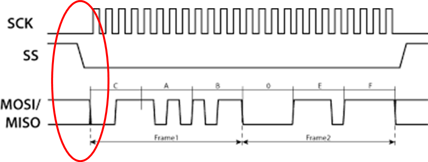
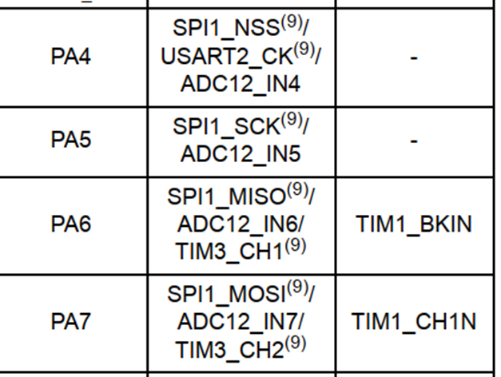
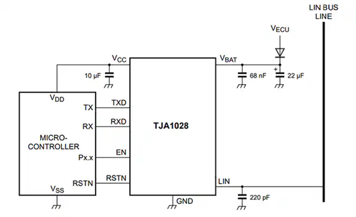
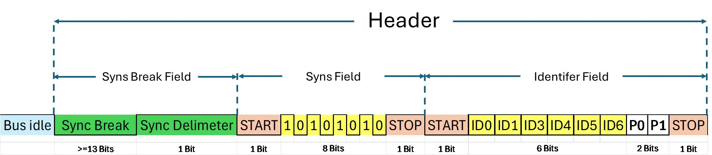

# LESSON 01: SET UP AND CREATE NEW PROJECTS IN KEILC
<details><summary>Details</summary>
<p>

</p>
</details>

# LESSON 02: GPIO
<details><summary>Details</summary>
<p>

## 1. Thư viện STM32F10x SPL (Standard Peripherals Library)
## 2. Lý thuyết về GPIO

GPIO-General Purpose Input/Output là các chân trên vi điều khiển có thể lập trình để truyền nhận tín 
hiệu với các thiết bị bên ngoài hoặc thực hiện các chức năng giao tiếp 
khác.
 
GPIO hoạt động ở các chế độ sau:

### GPIO Intput

Ở chế độ này, chân GPIO được sử dụng để nhận tín hiệu từ bên ngoài vào vi điều khiển.

Các loại Input Mode:

 - **Floating hay High-impedance (thả nổi)**: Chân GPIO không có trạng thái điện áp xác định khi không có tín hiệu vào. 

    Ví dụ:

    Mắc một nút nhấn theo kiểu Floating như hình, khi không nhấn nút thì không có tín hiệu vào.

    Khi nhấn nút, VĐK nhận tín hiệu tùy vào chân còn lại của nút nhấn mắc với Vcc hay Gnd (trong hình là Gnd, VĐK nhận mức thấp (0)).

    <p align="center">
        
    </p>

    _Không nên sử dụng mode này! Dễ bị nhiễu lúc không có tín hiệu và tốn năng lượng_

 - **Pull-up (điện trở kéo lên)**: Chân GPIO ở mức cao khi không có tín hiệu đầu vào.
    
    Ví dụ: 
    
    Mắc một nút nhấn theo kiểu pull-up như hình, khi không nhấn nút thì PMOS dẫn, VĐK sẽ nhận mức cao (1).
    <p align="center">
        
    </p>

    Ngược lại khi nhấn nút, NMOS dẫn thì VĐK nhận mức thấp (0).
    <p align="center">
        
    </p>

 - **Pull-down (điện trở kéo xuống)**: Chân GPIO ở mức thấp khi không có tín hiệu đầu vào.
    
    Ví dụ: 

    Mắc một nút nhấn theo kiểu pull-down như hình, khi không nhấn nút thì NMOS dẫn, VĐK sẽ nhận mức thấp (0).

    <p align="center">
        
    </p>

    Ngược lại khi nhấn nút, PMOS dẫn thì VĐK nhận mức cao (1).
    <p align="center">
        
    </p>

### GPIO Input

Ở chế độ này, chân GPIO được sử dụng để xuất tín hiệu ra bên ngoài từ vi điều khiển.

Các loại Output Mode:

 - Push-Pull: Chân GPIO xuất ra có thể là mức cao (1) hoặc mức thấp (0).

    Ví dụ:

    Khi VĐK xuất mức cao (1), PMOS dẫn và chân GPIO sẽ ở mức cao (1).
    <p align="center">
        
    </p>

    Ngược lại, VĐK xuất mức thấp (0), NMOS dẫn và chân GPIO sẽ ở mức thấp (0).
    <p align="center">
        
    </p>

 - Open-Drain: Chân GPIO chỉ  có thể xuất ra mức thấp (0) hoặc ở trạng thái "thả nổi".

    Ví dụ:

    Khi ở mode Open-Drain thì Output Buffer chỉ còn lại một NMOS.

    Khi VĐK xuất mức cao (1), NMOS không dẫn và chân GPIO sẽ thả nổi.
    
    Khi VĐK xuất mức thấp (0), NMOS dẫn và chân GPIO sẽ ở mức thấp (0).

    <p align="center">
        
    </p>

    _Nếu VĐK dùng mosfet thì gọi là Open-Drain, còn nếu dùng BJT gọi là Open-Collector._

### Analog

Ở chế độ này, chân GPIO kết nối với bộ chuyển đổi ADC (analog-to-digital converter) bên trong và cho phép đọc một giá trị đại diện cho điện áp trên chân đó. 

Giá trị này phụ thuộc vào độ phân giải của ADC. 

Ví dụ: ADC 12-bit có thể có các giá trị từ 0 đến 4095. Giá trị này được ánh xạ tới một điện áp nằm trong khoảng từ 0V đến điện áp mà vi điều khiển đang hoạt động (ví dụ, 3.3V). 

Khi một GPIO được cấu hình ở chế độ analog, các điện trở kéo lên/kéo xuống đầu vào sẽ bị vô hiệu (thả nổi).

_Sẽ học kĩ hơn ở bài ADC._

### Alternate Function

Ngoài ba chế độ trên, các chân GPIO còn có thể cung cấp các chức năng thay thế.

Ví dụ các chức năng thay thế: chân Rx/Tx cho giao tiếp UART, chân SDA/SCL cho giao tiếp I2C, v.v.

Để cấu hình cho chức năng thay thế, ta phải tác động lên các thanh ghi cụ thể, sẽ học kĩ hơn ở các bài sau.

## 3. Lập trình với GPIO

Để sử dụng một ngoại vi bất kì phải trải qua các bước sau:

<p align="center">
    
</p>

Như các thư viện khác (HAL, LL, CMSIS,...), SPL cung cấp các hàm và các định nghĩa giúp việc cấu hình và sử dụng ngoại vi.

### Cấp xung clock cho GPIO

STM32 sử dụng các bus (như AHB, APB1, APB2) để giao tiếp với các ngoại vi như GPIO, UART, I2C, SPI, v.v.

Để sử dụng các ngoại vi này, trước tiên, cần cấp xung (clock) cho bus tương ứng thông qua việc sử dụng các API trong thư viện.

Tra thông tin clock trong Reference (trang 92) và Data sheet (trang 11) để biết được bus nào cần được cấp xung.

<p align="center">
    
</p>

Trong SPL, để bật xung clock cho ngoại vi GPIO:

```c
void RCC_Config(){
	RCC_APB2PeriphClockCmd(RCC_APB2Periph_GPIOC, ENABLE);
} 
```
 - Tham số thứ 1 là ngoại vi cần cấu hình clock. 

 - Tham số thứ 2 là giá trị quy định cấp (ENABLE) hay ngưng (DISABLE) xung clock cho ngoại vi đó.

### Cấu hình GPIO

Để cấu hình cho chân GPIO:
```c
void GPIO_Config(){
	GPIO_InitTypeDef GPIO_InitStructure;
	GPIO_InitStructure.GPIO_Pin = GPIO_Pin_13 | GPIO_Pin_14;
	GPIO_InitStructure.GPIO_Mode = GPIO_Mode_Out_PP;
	GPIO_InitStructure.GPIO_Speed = GPIO_Speed_50MHz;
	
	GPIO_Init(GPIOC, &GPIO_InitStructure);
}
```
Việc cấu hình GPIO được thực hiện thông qua việc khai báo và sử dụng struct `GPIO_InitTypeDef`, trong đó chứa các tham số cấu hình cho một chân GPIO cụ thể:

 - **GPIO_Pin**: Xác định chân hoặc các chân GPIO muốn cấu hình bằng cách sử dụng các macro như `GPIO_Pin_0`, `GPIO_Pin_1`,... hoặc kết hợp các chân bằng toán tử OR `|` nếu muốn cấu hình nhiều chân cùng lúc.

    <p align="center">
        
    </p>

 - **GPIO_Mode**: Xác định mode hoạt động của chân GPIO.

    <p align="center">
        
    </p>

 - **GPIO_Speed**: Chọn tốc độ đáp ứng của chân GPIO.

    <p align="center">
        
    </p>

Hàm khởi tạo GPIO_Init() nhận 2 tham số: 
 - GPIO_TypeDef: Chỉ định cổng GPIO muốn cấu hình (ví dụ: `GPIOA`, `GPIOB`, `GPIOC`,...).
 - &GPIO_InitStruct: Con trỏ đến biến cấu trúc `GPIO_InitTypeDef` chứa các thông số cấu hình.

### Sử dụng GPIO

Một số hàm thao tác với GPIO:

 - Đọc giá trị mức logic (0 hoặc 1) của một chân Input/Output cụ thể trên cổng GPIO.
    ```C
    uint8_t GPIO_ReadInputDataBit(GPIO_TypeDef* GPIOx, uint16_t GPIO_Pin);
    uint8_t GPIO_ReadOutputDataBit(GPIO_TypeDef* GPIOx, uint16_t GPIO_Pin);
    ```
 - Đọc toàn bộ giá trị đầu vào/ra của một cổng GPIO.

    _Giá trị trả về 16-bit, mỗi bit tương ứng với trạng thái của từng chân của cổng._

    ```C
    uint16_t GPIO_ReadInputData(GPIO_TypeDef* GPIOx);
    uint16_t GPIO_ReadOutputData(GPIO_TypeDef* GPIOx);
    ```
 - Đặt mức cao (1) / thấp (0) cho một hoặc nhiều chân output sử dụng OR `|` trên một cổng GPIO.

    ```C
    void GPIO_SetBits(GPIO_TypeDef* GPIOx, uint16_t GPIO_Pin);
    void GPIO_ResetBits(GPIO_TypeDef* GPIOx, uint16_t GPIO_Pin);
    ```
 - Ghi mức logic cụ thể (0 hoặc 1) cho một chân output.

    ```C
    void GPIO_WriteBit(GPIO_TypeDef* GPIOx, uint16_t GPIO_Pin, BitAction BitVal);
    ```

 - Ghi một giá trị 16-bit trực tiếp cho toàn bộ cổng GPIO, trong đó mỗi bit đại diện cho trạng thái của một chân.
    
    ```C
    void GPIO_Write(GPIO_TypeDef* GPIOx, uint16_t PortVal);
    ```
## 4. Bài tập (Xem trong folder: lesson-2-GPIO)

</p>
</details>


# LESSON 3: INTERRUPTS AND TIMER
<details><summary>Details</summary>
<p>

## 1. Ngắt

Ngắt là một cơ chế cho phép hệ thống tạm ngừng chương trình đang thực hiện để xử lý một sự kiện ưu tiên cao 
hơn, sau đó quay lại hoàn thành công việc còn dở.

Khi một ngắt xảy ra, vi điều khiển sẽ lưu lại trạng thái hiện tại và chuyển tới hàm phục vụ ngắt (ISR - Interrupt Service Routine).

Có 3 loại ngắt chính: Ngắt ngoài, ngắt timer, ngắt truyền thông.

<p align="center">
    
</p>

### Vector table

Vector table là một vùng trong bộ nhớ của vi điều khiển, chứa các địa chỉ của các hàm phục vụ ngắt tương ứng với từng ngắt.

_Full vector table ở trang 197._

<p align="center">
    
</p>

### Độ ưu tiên ngắt

Mỗi ngăt có độ ưu tiên khác nhau. Khi nhiều ngắt xảy ra, độ ưu tiên sẽ quyết định ngắt nào sẽ được thực thi trước.

STM32 quy định ngắt nào có số ưu tiên càng thấp thì có quyền càng cao. Các ưu tiên ngắt có thể lập trình được.

### Ngắt ngoài

Xảy ra khi có thay đổi điện áp trên các chân GPIO được cấu hình làm ngõ vào ngắt.

 - LOW: kích hoạt ngắt liên tục khi chân ở mức thấp.
 
 - HIGH: Kích hoạt liên tục khi chân ở mức cao.
 
 - Rising: Kích hoạt khi trạng thái trên chân chuyển từ thấp lên cao.
 
 - Falling: Kích hoạt khi trạng thái trên chân chuyển từ cao xuống thấp.

### Ngắt timer

Ngắt Timer xảy ra khi giá trị trong thanh ghi đếm của timer tràn. Giá trị tràn được xác định bởi giá trị cụ thể trong thanh ghi đếm của timer.

Vì đây là ngắt nội trong MCU, nên phải reset giá trị thanh ghi timer để có thể tạo được ngắt tiếp theo.


### Ngắt truyền thông

Ngắt truyền thông xảy ra khi có sự kiện truyền/nhận dữ liệu giữa MCU với các thiết bị bên ngoài hay với MCU. 

Ngắt này sử dụng cho nhiều phương thức như Uart, SPI, I2C…v.v nhằm đảm bảo việc truyền nhận chính xác.

## 2. Timer

Có thể hiểu 1 cách đơn giản: timer là 1 mạch digital logic có vai trò đếm mỗi chu kỳ clock (đếm lên hoặc đếm xuống).

Timer còn có thể hoạt động ở chế độ nhận xung clock từ các tín hiệu ngoài. Có thể là từ 1 nút nhấn, bộ đếm sẽ được tăng sau mỗi lần bấm nút (sườn lên hoặc sườn xuống tùy vào cấu hình). Ngoài ra còn các chế độ khác như PWM, định thời …vv.

STM32F103 có 7 Timer.

### Cấu hình timer

<p align="center">
    
</p>

- `TIM_ClockDivision`: Hệ số chia xung nhịp cho bộ lọc trong các chế độ Input Capture/Output Compare. Tham số này không ảnh hưởng đến tần số đếm của Timer.

- `TIM_Prescaler`: Dùng để chia tần số xung nhịp đầu vào cho Timer (tần số từ bus APB) trước khi cấp cho bộ đếm, điều chỉnh tốc độ đếm của Timer.

- `TIM_Period`: Giá trị tối đa mà bộ đếm sẽ đạt tới trước khi tràn và quay về đếm lại từ 0.


- `TIM_CounterMode`: Chế độ đếm.

    + `TIM_CounterMode_Up`, `TIM_CounterMode_Down`: Đếm lên/xuống.

    + `TIM_CounterMode_CenterAligned1`,...: Đếm ở giữa dùng cho PWM.

**Cấu hình mẫu timer và delay ms**:

```c
TIM_Config
{
    // Clock - Nguồn APB2: 72MHz
    RCC_APB1PeriphClockCmd(RCC_APB1Periph_TIM2, ENABLE);

    // Config parameters
    TIM_TimeBaseInitTypeDef TIM_TimeBaseInitStruct;

    TIM_TimeBaseInitStruct.TIM_ClockDivision = TIM_CKD_DIV1;     // Clock division (chỉ áp dụng cho bộ lọc Input Capture/Output Compare)
    TIM_TimeBaseInitStruct.TIM_Prescaler = 7200 - 1;             // Prescaler: 72 MHz / 7200 = 10 kHz (tần số thực tế của Timer, tần số đếm)
    TIM_TimeBaseInitStruct.TIM_Period = 0xFFFF;                  // Period: Đếm từ 0 đến 0xFFFF (65535), sau đó sẽ tràn

    // Chu kì timer/chu kì 1 lần đếm cho period từ 0->1: 1/10kHz = 0.1 ms

    TIM_TimeBaseInitStruct.TIM_CounterMode = TIM_CounterMode_Up; 

    // Enable TIM2
    TIM_TimeBaseInit(TIM2, &TIM_TimeBaseInitStruct);
    TIM_Cmd(TIM2, ENABLE);
}

void Delay_ms(uint16_t time_ms) 
{
    // Reset the Timer 2 counter
    TIM_SetCounter(TIM2, 0);

    // Calculate the required ticks
    uint16_t ticks = time_ms * 10; // With Timer frequency at 10 kHz, each tick equals 0.1 ms

    // Wait until the counter reaches the required ticks
    while (TIM_GetCounter(TIM2) < ticks);
}
```

</p>
</details>


# LESSON 04: BASIC COMMUNICATION PROTOCOLS
<details><summary>Details</summary>
<p>

## 1. SPI

## Đặc điểm và cấu trúc vật lý

SPI là chuẩn giao tiếp nối tiếp, đồng bộ, cấu trúc Master - Slave, song công (truyền nhận cùng một lúc được), 4 dây.

<p align="center">
    
</p>

Bốn chân giao tiếp gồm:
 - SCK (Serial Clock): Master tạo xung tín hiệu SCK và cung cấp cho Slave.
 - MISO (Master Input Slave Output): Tín hiệu tạo bởi Slave và nhận bởi Master.
 - MOSI (Master Output Slave Input): Tín hiệu tạo bởi Master và nhận bởi Slave. 
 - SS (Đôi khi CS- Slave Select/Chip Select): Chọn Slave cụ thể để giao tiếp bằng cách xuất tín hiệu đường SS tương ứng xuống mức 0 (Low). 

## Quá trình truyền nhận


Bắt đầu quá trình, master sẽ kéo chân CS của slave muốn giao tiếp xuống 0 để báo hiệu muốn truyền nhận.
Clock sẽ được cấp bởi master, tùy vào chế độ được cài, với mỗi xungc clock,  1 bit sẽ được truyền từ master đến slave và slave cũng truyền 1 bit cho master.
Các thanh ghi cập nhật giá trị và dịch 1 bit.
Lặp lại quá trình trên đến khi truyền xong 8 bit trong thanh ghi.
Giao tiếp song công.

## Các chế độ hoạt động

## 2. I2C
## Đặc điểm và cấu trúc vật lý

I2C là chuẩn giao tiếp nối tiếp, đồng bộ, cấu trúc Master - Slave, bán song công (chỉ truyền hoặc nhận tại một thời điểm), 2 dây.

## Quá trình truyền nhận
## Các chế độ hoạt động


## 2. UART
## Đặc điểm và cấu trúc vật lý

UART là chuẩn giao tiếp nối tiếp, không đồng bộ, song công, 2 dây


## Quá trình truyền nhận
## Các chế độ hoạt động

</p>
</details>


# LESSON 05: SPI SOFTWARE & SPI HARDWARE
<details><summary>Details</summary>
<p>

## 1. SPI Software

SPI Software là tự tự lập trình cách thức giao tiếp bằng cách điều khiển các chân GPIO để tạo ra các tín hiệu SPI, và có thể sử dụng thêm Timer để quản lý nhịp.

Kém linh hoạt và chậm hơn so với SPI Hardware, ít sử dụng.

_Code SPI Software cho master và slave để ở trong folder lesson-05._

### Xác định và cấu hình chân GPIO

<p align="center">
    
</p>

Chọn chân GPIO làm 4 chân SCK, MISO, MOSI, CS.

```c
#define SPI_SCK_Pin  GPIO_Pin_0
#define SPI_MISO_Pin GPIO_Pin_1
#define SPI_MOSI_Pin GPIO_Pin_2
#define SPI_CS_Pin   GPIO_Pin_3
#define SPI_GPIO     GPIOA
#define SPI_RCC      RCC_APB2Periph_GPIOA

void RCC_Config()
{
    // Enable clock for GPIO, Timer 2
    RCC_APB2PeriphClockCmd(SPI_RCC, ENABLE);
    RCC_APB1PeriphClockCmd(RCC_APB1Periph_TIM2, ENABLE);
}
```

Cấu hình chân cho:

- Master: SPI_SCK_Pin, SPI_MOSI_Pin, SPI_CS_Pin là **output push-pull**, SPI_MISO_Pin là **input floating**.

- Slave: SPI_SCK_Pin, SPI_MOSI_Pin, SPI_CS_Pin là **input floating**, SPI_MISO_Pin là **output push-pull**.

```c
void GPIO_Config()
{
    // Configure for MASTER
    GPIO_InitTypeDef GPIO_InitStructure;

    // Configure SCK, MOSI, and CS as output push-pull
    GPIO_InitStructure.GPIO_Pin = SPI_SCK_Pin | SPI_MOSI_Pin | SPI_CS_Pin;
    GPIO_InitStructure.GPIO_Mode = GPIO_Mode_Out_PP;
    GPIO_InitStructure.GPIO_Speed = GPIO_Speed_50MHz;
    GPIO_Init(SPI_GPIO, &GPIO_InitStructure);

    // Configure MISO as input floating
    GPIO_InitStructure.GPIO_Pin = SPI_MISO_Pin;
    GPIO_InitStructure.GPIO_Mode = GPIO_Mode_IN_FLOATING;
    GPIO_InitStructure.GPIO_Speed = GPIO_Speed_50MHz;
    GPIO_Init(SPI_GPIO, &GPIO_InitStructure);

    
    /*// Configure for SLAVE
    GPIO_InitTypeDef GPIO_InitStructure;

    // Configure SCK, MOSI, and CS as input floating
    GPIO_InitStructure.GPIO_Pin = SPI_SCK_Pin | SPI_MOSI_Pin | SPI_CS_Pin;
    GPIO_InitStructure.GPIO_Mode = GPIO_Mode_IN_FLOATING;
    GPIO_InitStructure.GPIO_Speed = GPIO_Speed_50MHz;
    GPIO_Init(SPI_GPIO, &GPIO_InitStructure);

    // Configure MISO as output push-pull
    GPIO_InitStructure.GPIO_Pin = SPI_MISO_Pin;
    GPIO_InitStructure.GPIO_Mode = GPIO_Mode_Out_PP;
    GPIO_InitStructure.GPIO_Speed = GPIO_Speed_50MHz;
    GPIO_Init(SPI_GPIO, &GPIO_InitStructure);
    */
}
```

### Tạo clock 

<p align="center">
    
</p>

Tín hiệu clock được tạo bằng cách kết hợp kéo chân SCK lên 1, xuống 0 và delay. Delay được tạo bằng timer.

```c
void Clock(){
    GPIO_WriteBit(SPI_GPIO, SPI_SCK_Pin, Bit_SET);
    delay_ms(4);
    GPIO_WriteBit(SPI_GPIO, SPI_SCK_Pin, Bit_RESET);
    delay_ms(4);
}
```
### Set trạng thái ban đầu

<p align="center">
    
</p>

Trạng thái ban đầu: SCK ở mức thấp (tùy mode), CS ở mức cao, MISO và MOSI ở mức nào cũng được.

```c
void SPI_Config()
{
    GPIO_WriteBit(SPI_GPIO, SPI_SCK_Pin, Bit_RESET);
    GPIO_WriteBit(SPI_GPIO, SPI_CS_Pin, Bit_SET);
    GPIO_WriteBit(SPI_GPIO, SPI_MISO_Pin, Bit_RESET);
    GPIO_WriteBit(SPI_GPIO, SPI_MOSI_Pin, Bit_RESET);
}
```


### Hàm truyền

Hàm truyền sẽ truyền lần lượt 8 bit trong byte dữ liệu:

 -Kéo CS xuống 0.

 -Truyền 1 bit.

 -Dịch 1 bit.

 -Gửi clock();

 -Kéo CS lên 1;

```c
void SPI_Master_Transmit(uint8_t u8Data)
{                          // 0b10010000
    uint8_t u8Mask = 0x80; // 0b10000000
    uint8_t tempData;
	
    GPIO_WriteBit(SPI_GPIO, SPI_CS_Pin, Bit_RESET);
    Delay_Ms(1);
	
    for (int i = 0; i < 8; i++)
    {
        tempData = u8Data & u8Mask;
        if (tempData)
        {
            GPIO_WriteBit(SPI_GPIO, SPI_MOSI_Pin, Bit_SET);
            Delay_Ms(1);
        }
        else
        {
            GPIO_WriteBit(SPI_GPIO, SPI_MOSI_Pin, Bit_RESET);
            Delay_Ms(1);
        }
        u8Data = u8Data << 1;
        Clock();
    }
    GPIO_WriteBit(SPI_GPIO, SPI_CS_Pin, Bit_SET);
    Delay_Ms(1);
}
```

### Hàm nhận

Hàm truyền sẽ truyền lần lượt 8 bit trong byte dữ liệu:

 -Kiểm tra CS ==0?.

 -Kiểm tra Clock==1?

 -Đọc data trên MOSI, ghi vào biến.

 -Dịch 1 bit.

 -Kiểm tra CS==1?

```c
uint8_t SPI_Slave_Receive(void)
{
    uint8_t dataReceive = 0x00; // 0b11000000
    uint8_t temp = 0x00, i = 0;

    while (GPIO_ReadInputDataBit(SPI_GPIO, SPI_CS_Pin));

    while (!GPIO_ReadInputDataBit(SPI_GPIO, SPI_SCK_Pin));

    for (i = 0; i < 8; i++)
    {
        if (GPIO_ReadInputDataBit(SPI_GPIO, SPI_SCK_Pin))
        {
            while (GPIO_ReadInputDataBit(SPI_GPIO, SPI_SCK_Pin))
			{
                temp = GPIO_ReadInputDataBit(SPI_GPIO, SPI_MOSI_Pin);
			}
            dataReceive = dataReceive << 1;
            dataReceive = dataReceive | temp;
        }
        while (!GPIO_ReadInputDataBit(SPI_GPIO, SPI_SCK_Pin));
    }
    return dataReceive;
}
```

### Truyền và nhận dữ liệu trong main

**Master truyền:**

```c
uint8_t DataTrans[] = {0,1,2,3,4,5,6,7,8,9};

int main()
{
    RCC_Config();
    GPIO_Config();
    TIM_Config();
    SPI_Config();

    while (1)
    {
        // Send 0 to 9
        for (uint8_t i = 0; i < 10; i++) 
        {
            SPI_Master_Transmit(DataTrans[i]); 
            Delay_Ms(500);           
        }
    }
}
```
**Slave nhận:**

```c
uint8_t Data;

int main()
{
    RCC_Config();
    GPIO_Config();
    TIM_Config();
    SPI_Config();

    while (1)
    {
        if (!(GPIO_ReadInputDataBit(SPI_GPIO, SPI_CS_Pin)))
        {
            for (int i = 0; i < 10; i++)
            {
                Data = SPI_Slave_Receive();
            }
        }
    }
}
```

## 2. SPI Hardware

SPI Hardware là sử dụng trực tiếp module được tích hợp trên vi điều khiển.

### Cấu hình chân GPIO và SPI

<p align="center">
    
</p>

<p align="center">
    
</p>

Vì chân của các bộ SPI trên VĐK là cố định nên phải cấu hình đúng chân (Ví dụ dùng SPI1).

Tương tự các ngoại vi khác, các tham số SPI được cấu hình trong `Struct SPI_InitTypeDef`:

 -`SPI_Mode`: Quy định chế độ hoạt động của thiết bị SPI. 

 -`SPI_Direction`: Quy định kiểu truyền của thiết bị.

 -`SPI_BaudRatePrescaler`: Hệ số chia clock cấp cho Module SPI.

 -`SPI_CPOL`: Cấu hình cực tính của SCK . Có 2 chế độ:

  + `SPI_CPOL_Low`: Cực tính mức 0 khi SCK không truyền xung.

  + `SPI_CPOL_High`: Cực tính mức 1 khi SCK không truyền xung.

  + `SPI_CPHA`: Cấu hình chế độ hoạt động của SCK. Có 2 chế độ:

  + `SPI_CPHA_1Edge`: Tín hiệu truyền đi ở cạnh xung đầu tiên.

  + `SPI_CPHA_2Edge`: Tín hiệu truyền đi ở cạnh xung thứ hai.

 -`SPI_DataSize`: Cấu hình số bit truyền. 8 hoặc 16 bit.

 -`SPI_FirstBit`: Cấu hình chiều truyền của các bit là MSB hay LSB.

 -`SPI_CRCPolynomial`: Cấu hình số bit CheckSum cho SPI.

 -`SPI_NSS`: Cấu hình chân SS là điều khiển bằng thiết bị hay phần mềm.

**Cấu hình cho Master**:

Master cấu hình chân MISO, SCK, MOSI là `GPIO_Mode_AF_P` và CS là `GPIO_Mode_Out_PP`.

```c
// Initialize SPI for Master mode and configure CS pin
void SPI1_Master_Init(void)
{
    SPI_InitTypeDef SPI_InitStructure;
    GPIO_InitTypeDef GPIO_InitStructure;

    // Enable the clock for SPI1 and GPIOA
    RCC_APB2PeriphClockCmd(RCC_APB2Periph_SPI1 | RCC_APB2Periph_GPIOA, ENABLE);

    // Configure GPIO pins for SPI1: SCK, MISO, MOSI
    GPIO_InitStructure.GPIO_Pin = GPIO_Pin_5 | GPIO_Pin_6 | GPIO_Pin_7;
    GPIO_InitStructure.GPIO_Speed = GPIO_Speed_50MHz;
    GPIO_InitStructure.GPIO_Mode = GPIO_Mode_AF_PP;
    GPIO_Init(GPIOA, &GPIO_InitStructure);

    // Configure CS pin (PA4) as Output Push-Pull
    GPIO_InitStructure.GPIO_Pin = GPIO_Pin_4;
    GPIO_InitStructure.GPIO_Mode = GPIO_Mode_Out_PP;
    GPIO_Init(GPIOA, &GPIO_InitStructure);
    GPIO_SetBits(GPIOA, GPIO_Pin_4); // Set CS high (inactive, not selecting slave)

    // Configure SPI in Master mode
    SPI_InitStructure.SPI_Direction = SPI_Direction_2Lines_FullDuplex;
    SPI_InitStructure.SPI_Mode = SPI_Mode_Master;
    SPI_InitStructure.SPI_DataSize = SPI_DataSize_8b;
    SPI_InitStructure.SPI_CPOL = SPI_CPOL_Low;
    SPI_InitStructure.SPI_CPHA = SPI_CPHA_1Edge;
    SPI_InitStructure.SPI_NSS = SPI_NSS_Soft;  // NSS managed by software
    SPI_InitStructure.SPI_BaudRatePrescaler = SPI_BaudRatePrescaler_16;
    SPI_InitStructure.SPI_FirstBit = SPI_FirstBit_MSB;
    SPI_InitStructure.SPI_CRCPolynomial = 7;
	
    SPI_Init(SPI1, &SPI_InitStructure);

    // Enable SPI1
    SPI_Cmd(SPI1, ENABLE);
}
```

**Cấu hình cho Slave**:

Slave cấu hình chân MISO, SCK, MOSI là `GPIO_Mode_AF_P` và CS là `GPIO_Mode_IN_FLOATING`.

```c
// Initialize SPI for Slave mode
void SPI1_Slave_Init(void)
{
    SPI_InitTypeDef SPI_InitStructure;
    GPIO_InitTypeDef GPIO_InitStructure;

    // Enable Clock for SPI1 and GPIOA
    RCC_APB2PeriphClockCmd(RCC_APB2Periph_SPI1 | RCC_APB2Periph_GPIOA, ENABLE);

    // Configure GPIO pins for SPI1: SCK, MISO, MOSI
    GPIO_InitStructure.GPIO_Pin = GPIO_Pin_5 | GPIO_Pin_6 | GPIO_Pin_7;
    GPIO_InitStructure.GPIO_Speed = GPIO_Speed_50MHz;
    GPIO_InitStructure.GPIO_Mode = GPIO_Mode_AF_PP;  // Alternate Function Push-Pull
    GPIO_Init(GPIOA, &GPIO_InitStructure);

    // Configure GPIO pin for CS (Chip Select) as Floating Input
    GPIO_InitStructure.GPIO_Pin = GPIO_Pin_4;
    GPIO_InitStructure.GPIO_Mode = GPIO_Mode_IN_FLOATING; // Input floating mode for CS
    GPIO_Init(GPIOA, &GPIO_InitStructure);

    // Configure SPI in Slave mode
    SPI_InitStructure.SPI_Direction = SPI_Direction_2Lines_FullDuplex;
    SPI_InitStructure.SPI_Mode = SPI_Mode_Slave;
    SPI_InitStructure.SPI_DataSize = SPI_DataSize_8b;
    SPI_InitStructure.SPI_CPOL = SPI_CPOL_Low;
    SPI_InitStructure.SPI_CPHA = SPI_CPHA_1Edge;
    SPI_InitStructure.SPI_NSS = SPI_NSS_Hard; // NSS is controlled by hardware
    SPI_InitStructure.SPI_FirstBit = SPI_FirstBit_MSB;
    SPI_InitStructure.SPI_CRCPolynomial = 7;
    SPI_Init(SPI1, &SPI_InitStructure);

    // Enable SPI1
    SPI_Cmd(SPI1, ENABLE);
}
```

### Master truyền và Slave nhận

**Master truyền**:
```c
// Transmit a single byte of data via SPI
void SPI1_Master_Transmit(uint8_t data)
{
    GPIO_ResetBits(GPIOA, GPIO_Pin_4); // Pull CS low to activate slave

    while (SPI_I2S_GetFlagStatus(SPI1, SPI_I2S_FLAG_TXE) == RESET);		// Wait for TXE (transmit buffer empty) to be set
    SPI_I2S_SendData(SPI1, data); // Send data
    while (SPI_I2S_GetFlagStatus(SPI1, SPI_I2S_FLAG_RXNE) == RESET);	// Wait until data is received
    SPI_I2S_ReceiveData(SPI1); // Read received data (discarded)

    GPIO_SetBits(GPIOA, GPIO_Pin_4); // Set CS high after transmission is complete
}

// Data array to transmit
uint8_t Data[10] = {0, 1, 2, 3, 4, 5, 6, 7, 8, 9};

int main(void)
{
    SPI1_Master_Init();  // Initialize SPI1 in Master mode
    TIM_Config();        // Configure the timer
    while (1)
    {
        for (int i = 0; i < 10; i++)
        {
            SPI1_Master_Transmit(Data[i]); // Transmit data from 0 to 9
            Delay_Ms(500);                 // Delay for 500 ms
        }
    }
}
```

**Slave nhận**:
```c
// Function to receive data via SPI1 in Slave mode
uint8_t SPI1_Slave_Receive(void)
{
    while (SPI_I2S_GetFlagStatus(SPI1, SPI_I2S_FLAG_RXNE) == RESET)
        ;                             // Wait until data is received
    return SPI_I2S_ReceiveData(SPI1); // Read received data
}

// Alternative function to receive a single byte via SPI
uint8_t SPI_Receive1Byte(void)
{
    uint8_t temp;
    while (SPI_I2S_GetFlagStatus(SPI1, SPI_I2S_FLAG_BSY) == 1);		// Wait until SPI is not busy
    temp = (uint8_t)SPI_I2S_ReceiveData(SPI1);
    while (SPI_I2S_GetFlagStatus(SPI1, SPI_I2S_FLAG_RXNE) == 0);	// Wait until data is received
    return temp;
}

uint8_t received_data = 0; // Variable to store received data

int main(void)
{
    SPI1_Slave_Init(); // Initialize SPI1 in Slave mode

    while (1)
    {
        // Check if CS (PA4) is low, indicating data transfer
        if (GPIO_ReadInputDataBit(GPIOA, GPIO_Pin_4) == 0)
        {
            // Loop to receive data 10 times
            for (int i = 0; i < 10; i++)
            {
                received_data = SPI1_Slave_Receive(); // Receive data and store in received_data
            }
        }
    }
}
```
</p>
</details>

# LESSON 06: I2C SOFTWARE & I2C HARDWARE
<details><summary>Details</summary>
<p>

## 1. I2C software

### Cấu hình chân GPIO

```c
#define I2C_SCL GPIO_Pin_6
#define I2C_SDA GPIO_Pin_7
#define I2C_GPIO GPIOB

// Configure GPIO for I2C SDA and SCL pins
void GPIO_Config()
{
	RCC_APB2PeriphClockCmd(RCC_APB2Periph_GPIOB, ENABLE);
	
    GPIO_InitTypeDef GPIO_InitStructure;
    GPIO_InitStructure.GPIO_Mode = GPIO_Mode_Out_OD; // Open-drain mode for I2C
    GPIO_InitStructure.GPIO_Pin = I2C_SDA | I2C_SCL;
    GPIO_InitStructure.GPIO_Speed = GPIO_Speed_50MHz;

    GPIO_Init(I2C_GPIO, &GPIO_InitStructure);
}
```

### Trạng thái ban đầu của SDA, SCK và tín hiệu Start/Stop

<p align="center">
    
</p>

SDA, SCK khi chưa giap tiếp ở trạng thái mức 1.

Tín hiệu Start: SDA xuống 0 sau đó SCL xuống 0.

Tín hiệu Stop: SCL lên 1 sau đó SDA lên 1.


```c
#define WRITE_SDA_0 GPIO_ResetBits(I2C_GPIO, I2C_SDA)
#define WRITE_SDA_1 GPIO_SetBits(I2C_GPIO, I2C_SDA)
#define WRITE_SCL_0 GPIO_ResetBits(I2C_GPIO, I2C_SCL)
#define WRITE_SCL_1 GPIO_SetBits(I2C_GPIO, I2C_SCL)
#define READ_SDA_VAL GPIO_ReadInputDataBit(I2C_GPIO, I2C_SDA)

// Initialize I2C line (set SDA and SCL high)
void I2C_Config()
{
    WRITE_SDA_1;
    Delay_Us(1);
    WRITE_SCL_1;
    Delay_Us(1);
}

// Generate I2C start condition
void I2C_Start()
{
    WRITE_SCL_1;
    Delay_Us(3);
    WRITE_SDA_1;
    Delay_Us(3);
    WRITE_SDA_0; // Pull SDA low before SCL
    Delay_Us(3);
    WRITE_SCL_0;
    Delay_Us(3);
}

// Generate I2C stop condition
void I2C_Stop()
{
    WRITE_SDA_0;
    Delay_Us(3);
    WRITE_SCL_1; // Pull SCL high before SDA
    Delay_Us(3);
    WRITE_SDA_1;
    Delay_Us(3);
}
```

### Hàm truyền và hàm nhận

<p align="center">
    
</p>

Hàm truyền này dùng chung cho truyền địa chỉ và truyền data (trong trường hợp master gửi chỉ thị cho slave).

```c
// Write a byte to I2C and check for ACK
Status I2C_Write(uint8_t u8Data)
{
    uint8_t i;
    Status result;

    for (i = 0; i < 8; i++)
    { // Write byte bit by bit
        if (u8Data & 0x80)
        {
            WRITE_SDA_1;
        }
        else
        {
            WRITE_SDA_0;
        }
        Delay_Us(3);
        WRITE_SCL_1; // Clock pulse
        Delay_Us(5);
        WRITE_SCL_0;
        Delay_Us(2);
        u8Data <<= 1;
    }
    WRITE_SDA_1; // Release SDA for ACK bit
    Delay_Us(3);
    WRITE_SCL_1; // Clock pulse for ACK bit
    Delay_Us(3);

    // Check for ACK from slave
    if (READ_SDA_VAL)
    {
        result = NOT_OK;
    }
    else
    {
        result = OK;
    }

    Delay_Us(2);
    WRITE_SCL_0;
    Delay_Us(5);

    return result;
}
```

```c
// Read a byte from I2C and send ACK/NACK
uint8_t I2C_Read(ACK_Bit _ACK)
{
    uint8_t i;
    uint8_t u8Ret = 0x00;
    WRITE_SDA_1; // Release SDA to receive data
    Delay_Us(3);
    for (i = 0; i < 8; ++i)
    {
        u8Ret <<= 1;
        WRITE_SCL_1; // Clock pulse
        Delay_Us(3);
        if (READ_SDA_VAL)
        { // Read bit
            u8Ret |= 0x01;
        }
        Delay_Us(2);
        WRITE_SCL_0;
        Delay_Us(5);
    }

    // Send ACK or NACK after reading byte
    if (_ACK)
    {
        WRITE_SDA_0;
    }
    else
    {
        WRITE_SDA_1;
    }
    Delay_Us(3);

    WRITE_SCL_1; // Clock pulse for ACK/NACK
    Delay_Us(5);
    WRITE_SCL_0;
    Delay_Us(5);

    return u8Ret;
}
```

### Ứng dụng ghi và đọc Eeprom

<p align="center">
    
</p>

Quá trình ghi:

Start->chờ xem gửi start được không->gửi địa chỉ slave+1 bit write->chờ ACK->gửi 8 bit high thanh ghi cần ghi của Eeprom->chờ ACK->gửi 8 bit low thanh ghi cần ghi của Eeprom->chờ AKC->gửi data cần ghi->chờ ACK->Stop.

**Hàm ghi vào Eeprom**

```c
typedef enum
{
    NOT_OK = 0,
    OK = 1
} Status;

// Write a byte to EEPROM at a specific address
Status EEPROM_WriteByte(uint8_t slave_address, uint8_t memory_address_high, uint8_t memory_address_low, uint8_t data)
{
    Status status;

    I2C_Start();  // Start I2C communication

    // Send the slave address with write bit
    status = I2C_Write(slave_address << 1);
    if (status != OK) return NOT_OK;

    // Send the high byte of the memory address
    status = I2C_Write(memory_address_high);
    if (status != OK) return NOT_OK;

    // Send the low byte of the memory address
    status = I2C_Write(memory_address_low);
    if (status != OK) return NOT_OK;

    // Send the data byte
    status = I2C_Write(data);
    if (status != OK) return NOT_OK;

    I2C_Stop();  // End write operation

    // Wait for EEPROM write cycle to complete (typically 5 ms)
    Delay_Us(5000);

    return OK;
}
```
Theo data sheet thì có nhiều chế độ đọc (Current Address Read, Random Read, Sequential Read).

<p align="center">
    
</p>

Sau đây là quá trình Random Read nghĩa là đọc giá trị một địa chỉ thanh ghi cụ thể:

Start->chờ xem gửi start được không->gửi địa chỉ slave+1 bit read->chờ ACK->gửi 8 bit high thanh ghi cần đọc của Eeprom->chờ ACK->gửi 8 bit low thanh ghi cần đọc của Eeprom->chờ AKC->đọc data->chờ NACK->Stop.

```c
typedef enum
{
    NACK = 0,
    ACK = 1
} ACK_Bit;

// Read a byte from EEPROM from a specific address
Status EEPROM_ReadByte(uint8_t slave_address, uint8_t memory_address_high, uint8_t memory_address_low, uint8_t* data)
{
    Status status;

    // Step 1: Set the memory address for reading
    I2C_Start();  // Start I2C communication

    // Send the slave address with write bit to set the address
    status = I2C_Write(slave_address << 1);
    if (status != OK) return NOT_OK;

    // Send the high byte of the memory address
    status = I2C_Write(memory_address_high);
    if (status != OK) return NOT_OK;

    // Send the low byte of the memory address
    status = I2C_Write(memory_address_low);
    if (status != OK) return NOT_OK;

    I2C_Start();  // Repeated start for reading

    // Step 2: Read data from EEPROM
    status = I2C_Write((slave_address << 1) | 1);  // Send slave address with read bit
    if (status != OK) return NOT_OK;

    *data = I2C_Read(NACK);  // Read data and send NACK to end communication

    I2C_Stop();  // End read operation

    return OK;
}
```

**Luồng hoạt động trong main()**

```c
int main()
{
    TIM2_Config(); // Configure Timer2 for delay function
    GPIO_Config(); // Configure GPIO pins for I2C
    I2C_Config();  // Initialize I2C lines (set idle state)

	// Define EEPROM I2C address (7-bit address) and memory location
	uint8_t slave_address = 0x57;
	uint8_t memory_address_high = 0x00;
	uint8_t memory_address_low = 0x10; // Specific memory address in EEPROM
	uint8_t data_to_send = 0x80;
	uint8_t received_data = 0x00;
	
	Status status;

    while (1)
    {

        // Write data to EEPROM
        status = EEPROM_WriteByte(slave_address, memory_address_high, memory_address_low, data_to_send);

        if (status == OK)
        {
            // Read back data from the same EEPROM address to verify
            status = EEPROM_ReadByte(slave_address, memory_address_high, memory_address_low, &received_data);
        }
		
        Delay_Us(1000); // Delay before repeating
    }
}
```
## 2. I2C hardware

### Cấu hình GPIO và reset SDA, SCL về trạng thái chưa gửi

```c
void GPIO_Config(void)
{
    // Enable the clock for GPIOB
    RCC_APB2PeriphClockCmd(RCC_APB2Periph_GPIOB, ENABLE);

    GPIO_InitTypeDef GPIO_InitStruct;
    
    // 1. Configure SCL and SDA as GPIO Output Push-Pull
    GPIO_InitStruct.GPIO_Pin = I2C_SCL | I2C_SDA;
    GPIO_InitStruct.GPIO_Mode = GPIO_Mode_Out_PP;
    GPIO_InitStruct.GPIO_Speed = GPIO_Speed_50MHz;
    GPIO_Init(GPIOB, &GPIO_InitStruct);

    // 2. Generate 8 clock pulses on SCL to release SDA
    for (volatile int i = 0; i < 8; i++) {
        // Set SCL high
        GPIO_SetBits(GPIOB, I2C_SCL);
        Delay_Us(1000);
        
        // Set SCL low
        GPIO_ResetBits(GPIOB, I2C_SCL);
        Delay_Us(1000);
    }
    
    // 3. Set both SCL and SDA to high level
    GPIO_SetBits(GPIOB, I2C_SCL | I2C_SDA);
	Delay_Us(1000);
	
    // 4. Reconfigure pins for I2C mode (Alternate Function Open-Drain)
    GPIO_InitStruct.GPIO_Mode = GPIO_Mode_AF_OD;
    GPIO_InitStruct.GPIO_Pin = I2C_SCL | I2C_SDA;
    GPIO_Init(GPIOB, &GPIO_InitStruct);
}
```

### Cấu hình tham số I2C Hardware

Tương tự các ngoại vi khác, các tham số I2C được cấu hình trong Struct I2C_InitTypeDef:

 - I2C_Mode: Cấu hình chế độ hoạt động cho I2C:

 - I2C_Mode_I2C: Chế độ I2C FM(Fast Mode);

 - I2C_Mode_SMBusDevice&I2C_Mode_SMBusHost: Chế độ SM(Slow Mode).
I2C_ClockSpeed: Cấu hình clock cho I2C, tối đa 100khz với SM và 400khz ở FM.

 - I2C_DutyCycle: Cấu hình chu kì nhiệm vụ của xung:

    + I2C_DutyCycle_2: Thời gian xung thấp/ xung cao =2;
 
    + I2C_DutyCycle_16_9: Thời gian xung thấp/ xung cao =16/9;

<p align="center">
    
</p>

 - I2C_OwnAddress1: Cấu hình địa chỉ thieets bij dang caau hinh.
 
 - I2C_Ack: Cấu hình ACK, có sử dụng ACK hay không.
 
 - I2C_AcknowledgedAddress: Cấu hình số bit địa chỉ. 7 hoặc 10 bit.
 
**Cấu hình mẫu**: 

```c
void I2C_Config()
{
	RCC_APB1PeriphClockCmd(RCC_APB1Periph_I2C1, ENABLE);
	
    I2C_InitTypeDef I2C_InitStructure;

    I2C_InitStructure.I2C_ClockSpeed = 400000; // Fast mode
    I2C_InitStructure.I2C_Mode = I2C_Mode_I2C;
    I2C_InitStructure.I2C_DutyCycle = I2C_DutyCycle_2;
    I2C_InitStructure.I2C_OwnAddress1 = 0x00; // Address Master
    I2C_InitStructure.I2C_Ack = I2C_Ack_Enable;
    I2C_InitStructure.I2C_AcknowledgedAddress = I2C_AcknowledgedAddress_7bit;

    I2C_Init(I2C1, &I2C_InitStructure);
    I2C_Cmd(I2C1, ENABLE);
}
```

### Hàm truyền và nhận

Đây là những hàm có sẵn:

 - Hàm `I2C_Send7bitAddress(I2C_TypeDef* I2Cx, uint8_t Address, uint8_t I2C_Direction)`: Gửi đi 7 bit address để xác định slave cần giao tiếp. Hướng truyền được xác định bởi I2C_Direction để thêm bit RW.

 - Hàm `I2C_SendData(I2C_TypeDef* I2Cx, uint8_t Data)`: Gửi đi 8 bit data.

 - Hàm `I2C_ReceiveData(I2C_TypeDef* I2Cx)`: Trả về 8 bit data.

 - Hàm `I2C_CheckEvent(I2C_TypeDef* I2Cx, uint32_t I2C_EVENT)` trả về kết quả kiểm tra I2C_EVENT tương ứng:

    + `I2C_EVENT_MASTER_MODE_SELECT`: Đợi Bus I2C về chế độ rảnh.

    + `I2C_EVENT_MASTER_TRANSMITTER_MODE_SELECTED`: Đợi xác nhận của Slave với yêu cầu nhận của Master.

    + `I2C_EVENT_MASTER_RECEIVER_MODE_SELECTED`: Đợi xác nhận của Slave với yêu cầu ghi của Master.

    + `I2C_EVENT_MASTER_BYTE_TRANSMITTED`: Đợi truyền xong 1 byte data từ Master.

    + `I2C_EVENT_MASTER_BYTE_RECEIVED`: Đợi Master nhận đủ 1 byte data.

### Ứng dụng ghi/đọc DS3231 và Eeprom

Quá trình ghi đọc như ở I2c software.

**Cài đặt giờ/phút/giây cho DS3231**:

```c
#define DS3231_ADDRESS 0x68 // 7-bit I2C address for DS3231

// Function to convert decimal to BCD (Binary-Coded Decimal) format
uint8_t DecimalToBCD(uint8_t decimal) {
    return ((decimal / 10) << 4) | (decimal % 10);
}

// Function to set the time (hours, minutes, and seconds) on the DS3231 RTC
void DS3231_SetTime(uint8_t hours, uint8_t minutes, uint8_t seconds) {
    // Convert time values to BCD format
    uint8_t bcd_seconds = DecimalToBCD(seconds);
    uint8_t bcd_minutes = DecimalToBCD(minutes);
    uint8_t bcd_hours = DecimalToBCD(hours);

    // Send START condition on the I2C bus
    I2C_GenerateSTART(I2C1, ENABLE);
    while (!I2C_CheckEvent(I2C1, I2C_EVENT_MASTER_MODE_SELECT));

    // Send DS3231 address with write intent
    I2C_Send7bitAddress(I2C1, DS3231_ADDRESS << 1, I2C_Direction_Transmitter);
    while (!I2C_CheckEvent(I2C1, I2C_EVENT_MASTER_TRANSMITTER_MODE_SELECTED));

    // Send register address 0x00 (seconds register) to start from seconds register
    I2C_SendData(I2C1, 0x00); // Register 0x00 for seconds
    while (!I2C_CheckEvent(I2C1, I2C_EVENT_MASTER_BYTE_TRANSMITTED));

    // Write seconds value to the seconds register
    I2C_SendData(I2C1, bcd_seconds);
    while (!I2C_CheckEvent(I2C1, I2C_EVENT_MASTER_BYTE_TRANSMITTED));

    // Write minutes value to the minutes register
    I2C_SendData(I2C1, bcd_minutes);
    while (!I2C_CheckEvent(I2C1, I2C_EVENT_MASTER_BYTE_TRANSMITTED));

    // Write hours value to the hours register
    I2C_SendData(I2C1, bcd_hours);
    while (!I2C_CheckEvent(I2C1, I2C_EVENT_MASTER_BYTE_TRANSMITTED));

    // Send STOP condition to end the I2C communication
    I2C_GenerateSTOP(I2C1, ENABLE);
}
```

**Đọc giờ/phút/giây cho DS3231**:

```c
// Function to convert from BCD (Binary-Coded Decimal) to decimal
uint8_t BCDToDecimal(uint8_t bcd) {
    return ((bcd >> 4) * 10) + (bcd & 0x0F);
}

// Function to read hours, minutes, and seconds from DS3231
void DS3231_GetTime(uint8_t* hours, uint8_t* minutes, uint8_t* seconds) {
	
    // Send START condition
    I2C_GenerateSTART(I2C1, ENABLE);
     while (!I2C_CheckEvent(I2C1, I2C_EVENT_MASTER_MODE_SELECT));
	
    // Send DS3231 address with write intent
    I2C_Send7bitAddress(I2C1, DS3231_ADDRESS << 1, I2C_Direction_Transmitter);
    while (!I2C_CheckEvent(I2C1, I2C_EVENT_MASTER_TRANSMITTER_MODE_SELECTED));

    // Send register address to start reading from (0x00 for seconds register)
    I2C_SendData(I2C1, 0x00);
    while (!I2C_CheckEvent(I2C1, I2C_EVENT_MASTER_BYTE_TRANSMITTED));

    // Send repeated START condition to switch to read mode
    I2C_GenerateSTART(I2C1, ENABLE);
    while (!I2C_CheckEvent(I2C1, I2C_EVENT_MASTER_MODE_SELECT));

    // Send DS3231 address with read intent
    I2C_Send7bitAddress(I2C1, DS3231_ADDRESS << 1 | 0x01, I2C_Direction_Receiver);
    while (!I2C_CheckEvent(I2C1, I2C_EVENT_MASTER_RECEIVER_MODE_SELECTED));

    // Read seconds from register 0x00
    while (!I2C_CheckEvent(I2C1, I2C_EVENT_MASTER_BYTE_RECEIVED));
    *seconds = I2C_ReceiveData(I2C1);

    // Read minutes from register 0x01
    while (!I2C_CheckEvent(I2C1, I2C_EVENT_MASTER_BYTE_RECEIVED));
    *minutes = I2C_ReceiveData(I2C1);

    // Read hours from register 0x02
    I2C_AcknowledgeConfig(I2C1, DISABLE); // Send NACK after reading the last byte
    while (!I2C_CheckEvent(I2C1, I2C_EVENT_MASTER_BYTE_RECEIVED));
    *hours = I2C_ReceiveData(I2C1);

    // Send STOP condition to end the read operation
    I2C_GenerateSTOP(I2C1, ENABLE);

    // Re-enable ACK for future communications
    I2C_AcknowledgeConfig(I2C1, ENABLE);

    // Convert BCD to decimal format
    *seconds = BCDToDecimal(*seconds);
    *minutes = BCDToDecimal(*minutes);
    *hours = BCDToDecimal(*hours);
}
```

**Ghi dữ liệu vào AT24C32**:
```c
// Write data to a specific memory address in At24c32
void At24c32_Write(uint8_t at24c32Addr, uint16_t memAddr, uint8_t dataValue)
{	
	// START
	I2C_GenerateSTART(I2C1, ENABLE);
	
	while (!I2C_CheckEvent(I2C1, I2C_EVENT_MASTER_MODE_SELECT));
	
	// Shift address left by 1 to write
	I2C_Send7bitAddress(I2C1, at24c32Addr << 1 , I2C_Direction_Transmitter);
	
	// ACK
	while (!I2C_CheckEvent(I2C1, I2C_EVENT_MASTER_TRANSMITTER_MODE_SELECTED));
	
	// Send high byte of memory address
	I2C_SendData(I2C1, (memAddr >> 8) & 0xFF);
	
	// ACK
    while (!I2C_CheckEvent(I2C1, I2C_EVENT_MASTER_BYTE_TRANSMITTED));
	
	//Send low byte of memory address
	I2C_SendData(I2C1, memAddr & 0xFF);
	
	// ACK
    while (!I2C_CheckEvent(I2C1, I2C_EVENT_MASTER_BYTE_TRANSMITTED));
	
	// Write data into EEPROM
	I2C_SendData(I2C1, dataValue);
	
	// ACK
    while (!I2C_CheckEvent(I2C1, I2C_EVENT_MASTER_BYTE_TRANSMITTED));
	
	// STOP
	I2C_GenerateSTOP(I2C1, ENABLE);
	
	// Add a delay to ensure it is completed
	Delay_Us(10000);
}
```

**Đọc dữ liệu ra AT24C32**:
```c
// Random read mode
uint8_t At24c32_Random_Read(uint8_t at24c32Addr, uint16_t memAddr)
{
    uint8_t receivedData;

	// Start
    I2C_GenerateSTART(I2C1, ENABLE);
    while (!I2C_CheckEvent(I2C1, I2C_EVENT_MASTER_MODE_SELECT));

	// Send slave address with write intent
    I2C_Send7bitAddress(I2C1, at24c32Addr << 1, I2C_Direction_Transmitter);
	
	// ACK
    while (!I2C_CheckEvent(I2C1, I2C_EVENT_MASTER_TRANSMITTER_MODE_SELECTED));

    // Send high byte of memory address
    I2C_SendData(I2C1, (memAddr >> 8) & 0xFF);
	
	// ACK
    while (!I2C_CheckEvent(I2C1, I2C_EVENT_MASTER_BYTE_TRANSMITTED));

    // Send low byte of memory address
    I2C_SendData(I2C1, memAddr & 0xFF);
	
	// ACL
    while (!I2C_CheckEvent(I2C1, I2C_EVENT_MASTER_BYTE_TRANSMITTED));

    // Start
    I2C_GenerateSTART(I2C1, ENABLE);
    while (!I2C_CheckEvent(I2C1, I2C_EVENT_MASTER_MODE_SELECT));

	// Send slave address with read intent
    I2C_Send7bitAddress(I2C1, at24c32Addr << 1 | 0x01, I2C_Direction_Receiver);
	
	// ACK
    while (!I2C_CheckEvent(I2C1, I2C_EVENT_MASTER_RECEIVER_MODE_SELECTED));

    // Read data from the specified address with NACK 
    I2C_AcknowledgeConfig(I2C1, DISABLE);
    while (!I2C_CheckEvent(I2C1, I2C_EVENT_MASTER_BYTE_RECEIVED));
	
	// Read data
    receivedData = I2C_ReceiveData(I2C1);

    // STOP
    I2C_GenerateSTOP(I2C1, ENABLE);

    // Re-enable ACK for future communications
    I2C_AcknowledgeConfig(I2C1, ENABLE);
	
	Delay_Us(10000);
	
    return receivedData;
}
```
</p>
</details>

# LESSON 07: UART
<details><summary>Details</summary>
<p>
## 1. UART software
## 2. UART hardware
</p>
</details>

# LESSON 08: EXTERNAL, TIMER, COMMUNICATION INTERRUPTS
<details><summary>Details</summary>
<p>

## 1. Ngắt ngoài, cấu hình GPIO/EXTI/NVIC

### Cấu hình GPIO

Để sử dụng được ngắt ngoài, ngoài bật clock cho GPIO tương ứng cần bật thêm clock cho AFIO.

Cấu hình chân ngắt ngoài là Input. Có thể cấu hình thêm trở kéo lên/xuống tùy theo cạnh ngắt được sử dụng.

### Cấu hình EXTI

<p align="center">
    
</p>
<p align="center">
    
</p>

STM32F103C8T6 có 16 line ngắt ngoài (EXTI0 -> EXTI15).

Mỗi EXTI line chỉ có thể kết nối với một chân GPIO tại một thời điểm.

Chọn chân GPIO nào sẽ kết nối với line ngắt thông qua cấu hình AFIO.

Hàm `GPIO_EXTILineConfig(uint8_t GPIO_PortSource, uint8_t GPIO_PinSource)` cấu hình chân ở chế độ sử dụng ngắt ngoài:

 - `GPIO_PortSource`: Chọn Port để sử dụng làm nguồn cho ngắt ngoài.

 - `GPIO_PinSource`: Chọn Pin để cấu hình.

Các tham số ngắt ngoài được cấu hình trong `Struct EXTI_InitTypeDef`, gồm:

 - `EXTI_Line`: Chọn line ngắt.

 - `EXTI_Mode`: Chọn Mode cho ngắt là Ngắt (thực thi hàm ngắt) hay Sự kiện (Không thực thi).

 - `EXTI_Trigger`: Cấu hình cạnh ngắt.

 - `EXTI_LineCmd`: Cho phép ngắt ở Line đã cấu hình.

### Cấu hình NVIC

Trong trường hợp nhiều ngắt xảy ra thì cần cấu hình NVIC để xác định mức ưu tiên.

Hàm NVIC_PriorityGroupConfig(), phân chia số lượng bit dành cho Preemption Priority và Sub Priority. 

<p align="center">
    
</p>

Bộ NVIC cấu hình các tham số ngắt và quản lý các vecto ngắt. Các tham số được cấu hình trong `NVIC_InitTypeDef`, bao gồm:

 - `NVIC_IRQChannel`: Cấu hình Vector Line ngắt tương ứng với ngắt sử dụng:

    + Vector EXTI0 -> EXTI4: Quản lý Line0->Line4.

    + Vector EXTI9_5: Quản lý Line5->Line9.

    + Vector EXTI15_10: Quản lý Line10->Line15.

<p align="center">
    
</p>

 - `NVIC_IRQChannelPreemptionPriority`: Độ ưu tiên chính.

 - `NVIC_IRQChannelSubPriority`: Độ ưu tiên phụ.

 - `NVIC_IRQChannelCmd`: ENABLE/DISABLE ngắt.

**Cấu hình mẫu cho chân PA0 làm ngắt ngoài**:

```c
// Hàm cấu hình EXTI line 0 cho PA0 với Pull-Up
void EXTI_Config(void) {
    // Bật Clock cho GPIOA và AFIO
    RCC_APB2PeriphClockCmd(RCC_APB2Periph_GPIOA | RCC_APB2Periph_AFIO, ENABLE);

    // Cấu hình PA0 làm Input Pull-Up
    GPIO_InitTypeDef GPIO_InitStruct;
    GPIO_InitStruct.GPIO_Pin = GPIO_Pin_0;
    GPIO_InitStruct.GPIO_Mode = GPIO_Mode_IPU; // Input Pull-Up
    GPIO_InitStruct.GPIO_Speed = GPIO_Speed_50MHz;
    GPIO_Init(GPIOA, &GPIO_InitStruct);

    // Cấu hình EXTI line 0 để kích hoạt ngắt ngoài từ PA0
    GPIO_EXTILineConfig(GPIO_PortSourceGPIOA, GPIO_PinSource0);

    EXTI_InitTypeDef EXTI_InitStruct;
    EXTI_InitStruct.EXTI_Line = EXTI_Line0;                 // Chọn line EXTI 0
    EXTI_InitStruct.EXTI_Mode = EXTI_Mode_Interrupt;        // Chế độ ngắt
    EXTI_InitStruct.EXTI_Trigger = EXTI_Trigger_Falling;    // Kích hoạt ngắt khi có cạnh xuống
    EXTI_InitStruct.EXTI_LineCmd = ENABLE;                  // Kích hoạt line EXTI 0
    EXTI_Init(&EXTI_InitStruct);

    // Cấu hình nhóm ưu tiên ngắt trong NVIC
    // 2 bit cho Preemption Priority, 2 bit cho Sub Priority
    NVIC_PriorityGroupConfig(NVIC_PriorityGroup_2);         

    // Cấu hình ưu tiên ngắt trong NVIC cho EXTI line 0
    NVIC_InitTypeDef NVIC_InitStruct;
    NVIC_InitStruct.NVIC_IRQChannel = EXTI0_IRQn;           // Kênh ngắt EXTI0
    NVIC_InitStruct.NVIC_IRQChannelPreemptionPriority = 0;  // Độ ưu tiên của ngắt (có thể tùy chỉnh)
    NVIC_InitStruct.NVIC_IRQChannelSubPriority = 0;         // Độ ưu tiên của ngắt (có thể tùy chỉnh)
    NVIC_InitStruct.NVIC_IRQChannelCmd = ENABLE;            // Kích hoạt kênh ngắt trong NVIC
    NVIC_Init(&NVIC_InitStruct);
}
```
### Hàm phục vụ ngắt

Ngắt trên từng line có hàm phục riêng của từng line. Có tên cố định: EXTIx_IRQHandler() (x là line ngắt tương ứng). 

Hàm EXTI_GetITStatus(EXTI_Linex), Kiểm tra cờ ngắt của line x tương ứng. 

Hàm EXTI_ClearITPendingBit(EXTI_Linex): Xóa cờ ngắt ở line x.

Trong hàm phục vụ ngắt ngoài, chúng ta sẽ thực hiện:

 - Kiểm tra ngắt đến từ line nào, có đúng là line cần thực thi hay không?

 - Thực hiện các lệnh, các hàm.

 - Xóa cờ ngắt ở line.

**Hàm ngắt mẫu**:

```c
void EXTI0_IRQHandler()
    
{	// Kiểm tra ngắt line 0 
    if(EXTI_GetITStatus(EXTI_Line0) != RESET)
    {
        // Do somthing
    }
    // Xóa cờ ngắt line 0
    EXTI_ClearITPendingBit(EXTI_Line0);
}
```

## 2. Ngắt timer

### Cấu hình timer

Sử dụng ngắt timer, ta vẫn cấu hình các tham số trong TIM_TimeBaseInitTypeDef bình thường, riêng TIM_Period, đây là số lần đếm mà sau đó timer sẽ ngắt. 

Cài đặt Period = 10-1 ứng với ngắt mỗi 1ms.

Hàm TIM_ITConfig(TIMx, TIM_IT_Update, ENABLE) kích hoạt ngắt cho TIMERx tương ứng.

```c

void TIM_Config()
{
   
TIM_TimeBaseInitTypeDef TIM_TimeBaseInitStruct;
RCC_APB1PeriphClockCmd(RCC_APB1Periph_TIM2, ENABLE);
TIM_TimeBaseInitStruct.TIM_Prescaler = 7200-1;
TIM_TimeBaseInitStruct.TIM_Period = 10-1;
TIM_TimeBaseInitStruct.TIM_ClockDivision = TIM_CKD_DIV1;
TIM_TimeBaseInitStruct.TIM_CounterMode = TIM_CounterMode_Up;
TIM_TimeBaseInit(TIM2, &TIM_TimeBaseInitStruct);

   TIM_ITConfig(TIM2, TIM_IT_Update, ENABLE);
   TIM_Cmd(TIM2, ENABLE);
}
```

### Cấu hình NVIC

Ở NVIC, ta cấu hình tương tự như ngắt ngoài EXTI, tuy nhiên NVIC_IRQChannel được đổi thành TIM_IRQn để khớp với line ngắt timer.

**Cấu hình mẫu cho ngắt timer**:

```c
void TIM_Config(void) {
    // Cấu hình Timer 2
    TIM_TimeBaseInitTypeDef TIM_TimeBaseInitStruct;

    // Bật Clock cho Timer 2
    RCC_APB1PeriphClockCmd(RCC_APB1Periph_TIM2, ENABLE);

    // Cấu hình các tham số cho Timer 2
    TIM_TimeBaseInitStruct.TIM_Prescaler = 7200 - 1;         // Prescaler: 72 MHz / 7200 = 10 kHz
    TIM_TimeBaseInitStruct.TIM_Period = 10000 - 1;           // Period: 1s đếm lên 1 lần 
    TIM_TimeBaseInitStruct.TIM_ClockDivision = TIM_CKD_DIV1; // Không chia thêm xung clock
    TIM_TimeBaseInitStruct.TIM_CounterMode = TIM_CounterMode_Up; // Đếm tăng
    TIM_TimeBaseInit(TIM2, &TIM_TimeBaseInitStruct);

    // Bật ngắt Timer 2 cho sự kiện cập nhật
    TIM_ITConfig(TIM2, TIM_IT_Update, ENABLE);

    // Kích hoạt Timer 2
    TIM_Cmd(TIM2, ENABLE);

    // Cấu hình NVIC cho Timer 2
    NVIC_Config();
}

void NVIC_Config(void) {
    // Thiết lập cấu hình nhóm ưu tiên ngắt
    NVIC_PriorityGroupConfig(NVIC_PriorityGroup_2); // 2 bit cho Preemption Priority, 2 bit cho Sub Priority

    // Cấu hình ngắt cho Timer 2 trong NVIC
    NVIC_InitTypeDef NVIC_InitStruct;
    NVIC_InitStruct.NVIC_IRQChannel = TIM2_IRQn;             // Chọn kênh ngắt của Timer 2
    NVIC_InitStruct.NVIC_IRQChannelPreemptionPriority = 0;   // Thiết lập độ ưu tiên preemption
    NVIC_InitStruct.NVIC_IRQChannelSubPriority = 0;          // Thiết lập độ ưu tiên sub
    NVIC_InitStruct.NVIC_IRQChannelCmd = ENABLE;             // Kích hoạt kênh ngắt trong NVIC
    NVIC_Init(&NVIC_InitStruct);
}
```

### Hàm phục vụ ngắt timer

Hàm phục vụ ngắt Timer được đặt tên : TIMx_IRQHandler() với x là timer tương ứng.	

Kiểm tra cờ bằng hàm TIM_GetITStatus() Hàm này trả về giá trị kiểm tra xem timer đã tràn hay chưa.

TIM_IT_Update: Cờ báo tràn và update giá trị cho timer, cờ này bật lên mỗi 1ms.

Sau khi thực hiện xong, gọi TIM_ClearITPendingBit(TIMx, TIM_IT_Update) để xóa cờ này.

**Tạo Delay dựa trên hàm phục vụ ngắt timer**:

```c
uint16_t count;

void delay(int time)
{
    count = 0; 
    while(count<time){}
}

void TIM2_IRQHandler()
{
    // Chờ ngắt
    if(TIM_GetITStatus(TIM2, TIM_IT_Update))
    {
    count++;
    }
    // Xóa cờ ngắt
    TIM_ClearITPendingBit(TIM2, TIM_IT_Update);
}
```
## 3. Ngắt truyền thông

STM32F1 hỗ trọ các ngắt cho các giao thức truyền nhận như SPI, I2C, UART…

Ví dụ với UART ngắt.

Các ngắt ở SPI, I2C… sẽ được cấu hình tương tự như UART.

### Cấu hình UART

### Cấu hình NVIC

### Hàm phục vụ ngắt UART


</p>
</details>

# LESSON 09: ADC
<details><summary>Details</summary>
<p>

## 1. Lý thuyết ADC

<p align="center">
    
</p>

Vi điều khiển cũng như hầu hết các thiết bị điện tử ngày nay đều sử dụng tín hiệu kĩ thuật số, dựa trên các bit nhị phân để hoạt động.

Ngoài tín hiệu số, trong thực tế còn có tín hiệu tương tự và liên tục, vì thế để các thiết bị hiểu được cần phải chuyển đổi nó về dạng số.

ADC (Analog-to-Digital Converter) là 1 mạch điện tử lấy điện áp tương tự làm đầu vào và chuyển đổi nó thành dữ liệu số (1 giá trị đại diện cho mức điện áp trong mã nhị phân).


Khả năng chuyển đổi của ADC được quyết định bởi 2 yếu tố chính:

 - Độ phân giải: Số bit mà ADC sử dụng để mã hóa tín hiệu. Có thể xem như là số mức mà tín hiệu tương tự được biểu diễn. ADC có độ phân giải càng cao thì cho ra kết quả chuyển đổi càng chi tiết. 

    <p align="center">
        
    </p>

 - Tần số/chu kì lấy mẫu: Tốc độ/khoảng thời gian giữa 2 lần mã hóa. Tần số lấy mẫu càng lớn thì tín hiệu sau khi chuyển đổi sẽ có độ chính xác càng cao. Khả năng tái tạo lại tín hiệu càng chính xác. Tần số lấy mẫu = 1/(Time lấy mẫu + Time chuyển đổi.)
 
    <p align="center">
        
    </p>

Tần số lấy mẫu phải lớn hơn tần số của tín hiệu ít nhất 2 lần để đảm bảo độ chính xác khi khôi phục lại tín hiệu.

## 2. Lập trình ADC

STM32F103C8 có 2 bộ ADC đó là ADC1 và ADC2 với nhiều mode hoạt động 
Kết quả chuyển đổi được lưu trữ trong thanh ghi 16 bit. 

Độ phân giải 12 bit.
Có các ngắt hỗ trợ.
Có thể điều khiển hoạt động ADC bằng xung Trigger.
Thời gian chuyển đổi nhanh : 1us tại tần số 65Mhz.
Có bộ DMA giúp tăng tốc độ xử lí.

### Cấp xung RCC

Các bộ ADC được cấp xung từ RCC APB2, để bộ ADC hoạt động cần cấp xung cho cả ADC để tạo tần số lấy mẫu tín hiệu và cấp xung cho GPIO của Port ngõ vào.

```c
void RCC_Config()
{
	RCC_APB2PeriphClockCmd(RCC_APB2Periph_GPIOA | RCC_APB2Periph_ADC1 | RCC_APB2Periph_AFIO, ENABLE);
	RCC_APB1PeriphClockCmd(RCC_APB1Periph_TIM2, ENABLE);
}
```
### Cấu hình chân đọc tín hiệu và tham số cho ADC

Regular Conversion:

 - Single: ADC chỉ đọc 1 kênh duy nhất, và chỉ đọc khi nào được yêu cầu.

 - Single Continuous: ADC sẽ đọc một kênh duy nhất, nhưng đọc dữ liệu nhiều lần liên tiếp (Có thể được biết đến như sử dụng DMA để đọc dữ liệu và ghi vào bộ nhớ). 

 - Scan: Multi-Channels: Quét qua và đọc dữ liệu nhiều kênh, nhưng chỉ đọc khi nào được yêu cầu.

 - Scan: Continuous Multi-Channels Repeat: Quét qua và đọc dữ liệu nhiều kênh, nhưng đọc liên tiếp nhiều lần giống như Single Continous. 

Injected Conversion:

Trong trường hợp nhiều kênh hoạt động. Khi kênh có mức độ ưu tiên cao hơn có thể tạo ra một Injected Trigger. Khi gặp Injected Trigger thì ngay lập tức kênh đang hoạt động bị ngưng lại để kênh được ưu tiên kia có thể hoạt động.


Cấu hình GPIO: ADC hỗ trợ rất nhiều kênh, mỗi kênh lấy tín hiệu từ các chân GPIO của các Port và từ các chân khác. Các chân GPIO dùng làm ngõ vào cho ADC sẽ được cấu hình Mode AIN.(Analogue Input).

Các tham số cấu hình cho bộ ADC được tổ chức trong Struct `ADC_InitTypeDef`:

 - `ADC_Mode`:  Cấu hình chế độ hoạt động cho ADC là đơn kênh (Independent) hay đa kênh, ngoài ra còn có các chế độ ADC chuyển đổi tuần tự các kênh (regularly) hay chuyển đổi khi có kích hoạt (injected).

 - `ADC_NbrOfChannel`: Số kênh ADC để cấu hình.

 - `ADC_ContinuousConvMode`: Cấu hình bộ ADC có chuyển đổi liên tục hay không, Enable để cấu hình ADC  chuyển đổi lien tục, nếu cấu hình Disable, ta phải gọi lại lệnh đọc ADC để bắt đầu quá trình chuyển đổi. 

 - `ADC_ExternalTrigConv`: Enable để sử dụng tín hiệu trigger. 

 - `ADC_ScanConvMode`: Cấu hình chế độ quét ADC lần lượt từng kênh. Enable nếu sử dụng chế độ quét này.

 - `ADC_DataAlign`: Cấu hình căn lề cho data. Vì bộ ADC xuất ra giá trị 12bit, được lưu vào biến 16 hoặc 32 bit nên phải căn lề các bit về trái hoặc phải.

Ngoài các tham số trên, cần cấu hình thêm thời gian lấy mẫu, thứ tự kênh ADC khi quét,

 - `ADC_RegularChannelConfig(ADC_TypeDef* ADCx, uint8_t ADC_Channel, uint8_t Rank, uint8_t ADC_SampleTime)`:

    + `Rank`: Ưu tiên của kênh ADC.

    + `SampleTime`: Thời gian lấy mẫu tín hiệu.


 - `ADC_SoftwareStartConvCmd(ADC_TypeDef* ADCx, FunctionalState NewState)`: Bắt đầu quá trình chuyển đổi.

 - `ADC_GetConversionValue(ADC_TypeDef* ADCx)`: Đọc giá trị chuyển đổi được ở các kênh ADC tuần tự.

 - `ADC_GetDualModeConversionValue(void)`: Trả về giá trị chuyển đổi cuối cùng của ADC1, ADC2 ở chế độ kép.

**Cấu hình mẫu**:

```c
void GPIO_Config()
{
    GPIO_InitTypeDef GPIO_InitStruct;
    GPIO_InitStruct.GPIO_Mode = GPIO_Mode_AIN;
    GPIO_InitStruct.GPIO_Pin = GPIO_Pin_0;
    GPIO_InitStruct.GPIO_Speed = GPIO_Speed_50MHz;
    GPIO_Init(GPIOA, &GPIO_InitStruct);
}

void ADC_Config()
{
    ADC_InitTypeDef ADC_InitStruct;

    ADC_InitStruct.ADC_Mode = ADC_Mode_Independent;
    ADC_InitStruct.ADC_NbrOfChannel = 1;
    ADC_InitStruct.ADC_ScanConvMode = DISABLE;
    ADC_InitStruct.ADC_ExternalTrigConv = ADC_ExternalTrigConv_None;
    ADC_InitStruct.ADC_ContinuousConvMode = ENABLE;
    ADC_InitStruct.ADC_DataAlign = ADC_DataAlign_Right;

    ADC_Init(ADC1, &ADC_InitStruct);
    ADC_RegularChannelConfig(ADC1, ADC_Channel_0, 1, ADC_SampleTime_55Cycles5);
    ADC_Cmd(ADC1, ENABLE);
    ADC_SoftwareStartConvCmd(ADC1, ENABLE);
}
```
### Đọc tín hiệu


### Lọc tín hiệu bằng Kalman

Giá trị đo được trên ADC có thể bị nhiễu, vọt lố do nhiều lý do khách quan về phần cứng.

Phương pháp trung bình không thể giảm thiểu nhiễu, thay vào đó sử dụng lọc Kalman.

```c
// Global variables for Kalman Filter
float _err_measure = 1;  // Measurement error (initial value)
float _err_estimate = 1; // Estimation error (initial value)
float _q = 0.01;         // Process noise
float _kalman_gain = 0;
float _current_estimate = 0; // Current estimated value
float _last_estimate = 0;    // Previous estimated value

// Kalman Filter initialization function
void SimpleKalmanFilter(float mea_e, float est_e, float q)
{
    _err_measure = mea_e;
    _err_estimate = est_e;
    _q = q;
}

// Kalman Filter update function
float updateEstimate(float mea)
{
    _kalman_gain = _err_estimate / (_err_estimate + _err_measure);
    _current_estimate = _last_estimate + _kalman_gain * (mea - _last_estimate);
    _err_estimate = (1.0 - _kalman_gain) * _err_estimate + fabs(_last_estimate - _current_estimate) * _q;
    _last_estimate = _current_estimate;
    return _current_estimate;
}
```
</p>
</details>

# LESSON 10: DMA
<details><summary>Details</summary>
<p>

<p align="center">
    
</p>

CPU sẽ điều khiển việc trao đổi data giữa Peripheral (UART, I2C, SPI, ...) và bộ nhớ (RAM) qua các đường bus. 

CPU phải lấy lệnh từ bộ nhớ (FLASH) để thực thi các lệnh của chương trình. 

Vì vậy, khi cần truyền dữ liệu liên tục giữa Peripheral và RAM, CPU sẽ bị chiếm dụng, và không có thời gian làm các công việc khác, hoặc có thể gây miss dữ liệu khi transfer. 

## 1. Lý thuyết DMA - Truy cập bộ nhớ trực tiếp 

<p align="center">
    
</p>

DMA – Direct memory access được sử dụng với mục đích truyền data với tốc độ cao từ thiết bị ngoại vi đến bộ nhớ cũng như từ bộ nhớ đến bộ nhớ.

DMA có thể điều khiển data truyền từ :
 - Bộ nhớ đến Peripheral 

 - Ngược lại, Periph đến Bộ nhớ.

 - Giữa 2 vùng nhớ.

 - Không thông qua data bus  của CPU. 

-> Tiết kiệm tài nguyên của CPU cho các thao tác khác. Đồng thời tránh việc data nhận về từ ngoại vi bị mất mát.

<p align="center">
    
</p>

DMA có thể điều khiển data truyền từ SRAM đến Peripheral - UART và ngược lại, mà không thông qua data bus  của CPU. 

Các Channel đều có thể được cấu hình riêng biệt.

Mỗi Channel được kết nối để dành riêng cho tín hiệu DMA từ các thiết bị ngoại vi hoặc tín hiệu từ bên trong MCU.

Có 4 mức ưu tiên có thể lập trình cho mỗi Channel.

Kích thước data được sử dụng là 1 byte, 2 byte (Half Word) hoặc 4 byte (Word).

Hỗ trợ việc lặp lại liên tục Data.

5 cờ báo ngắt (DMA Half Transfer, DMA Transfer complete, DMA Transfer Error, DMA FIFO Error, Direct Mode Error).

Quyền truy cập tới Flash, SRAM, APB1, APB2, AHB.

Số lượng data có thể lập trình được lên tới 65535.

Đối với DMA2, mỗi luồng đều hỗ trợ để chuyển dữ liệu từ bộ nhớ đến bộ nhớ.

STM32F1 có 2 bộ DMA với nhiều kênh, mỗi kênh có nhiều ngoại vi có thể dùng DMA:

DMA có 2 chế độ hoạt động là normal và circular:

 - Normal mode: Với chế độ này, DMA truyền dữ liệu cho tới khi truyền đủ 1 lượng dữ liệu giới hạn đã khai báo DMA sẽ dừng hoạt động. Muốn nó tiếp tục hoạt động thì phải khởi động lại.


 - Circular mode: Với chế độ này, Khi DMA truyền đủ 1 lượng dữ liệu giới hạn đã khai báo thì nó sẽ truyền tiếp về vị trí ban đầu (Cơ chế như Ring buffer).
 


<p align="center">
    
</p>


</p>
</details>

# LESSON 11: FLASH - BOOTLOADER
<details><summary>Details</summary>
<p>

## 1. Bộ nhớ, flash và thao tác với flash trên stmf103c8t6

Ví dụ ta có một led RGB, làm sao để giữ được giá trị của R, G, B của led khi tắt nguồn và bật lại?
=>>Lưu trữ giá trị vào bộ nhớ.

Có 3 loại bộ nhớ trong một VĐK:

<p align="center">
    
</p>

### Flash trong STM32F103c8t6

STM32F1 không có EPROM mà chỉ được cung cấp sẵn 128/64Kb Flash.

Flash được chia nhỏ thành các Page, mỗi Page có kích thước 1Kb.

Flash có giới hạn về số lần xóa/ghi.

Trước khi ghi phải xóa Flash trước.

Thường được dùng để lưu chương trình.

<p align="center">
    
</p>

### Xóa và ghi flash

Thông thường chương trình sẽ được nạp vào vùng nhớ bắt đầu ở 0x08000000, vùng nhớ phía sau sẽ là trống và người dùng có thể lưu trữ dữ liệu ở vùng này.

Thư viện Std cung cấp các hàm để giao tiếp với Flash trong Module Flash. File "stm32f10x_flash.h".

<p align="center">
    
</p>

Mỗi lần ghi 2bytes hoặc 4bytes, tuy nhiên mỗi lần xóa phải xóa cả Page.

**Xóa FLash**

Sơ đồ xóa flash như hình:

<p align="center">
    
</p>

 - Đầu tiên, kiểm tra cờ LOCK của Flash, nếu Cờ này đang được bật, Flash đang ở chế độ Lock và cần phải được Unlock trước khi sử dụng.
 - Sau khi FLash đã Unlock, cờ CR_PER được set lên 1.
 - Địa chỉ của Page cần xóa được ghi vào FAR.
 - Set bit CR_STRT lên 1 để bắt đầu quá trình xóa.
 - Kiểm tra cờ BSY đợi haonf tất quá trình xóa.

Vì flash có cơ chế khóa và mở khóa mỗi lần xóa hoặc ghi nên thư viện cung cấp các hàm LOCK, UNLOCK Flash:

 - `void FLASH_Unlock(void)`: Hàm này Unlock cho tất cả vùng nhớ trong Flash.
 - `void FLASH_UnlockBank1(void)`: Hàm này chỉ Unlock cho Bank đầu tiên. Vì SMT32F103C8T6 chỉ có 1 Bank duy nhất nên chức năng tương tự hàm trên.
 - `void FLASH_UnlockBank2(void)`: Unlock cho Bank thứ 2.
 - `void FLASH_Lock(void)`: Lock bộ điều khiển xóa Flash cho toàn bộ vùng nhớ Flash.
 - `void FLASH_LockBank1(void)` và `void FLASH_LockBank2(void)`: Lock bộ điều khiển xóa Flash cho Bank 1 hoặc 2.

Các hàm xóa Flash:
 - `FLASH_Status FLASH_EraseAllBank1Pages(void)`: Xóa tất cả các Page trong Bank 1 của Flash. 
 - `FLASH_Status FLASH_EraseAllBank2Pages(void)`: Xóa tất cả các Page trong Bank 2 của Flash. 
 - `FLASH_Status FLASH_EraseAllPages(void)`: Xóa toàn bộ Flash.
 - `FLASH_Status FLASH_ErasePage(uint32_t Page_Address)`: Xóa 1 page cụ thể trong Flash, cụ thể là Page bắt đầu bằng địa chỉ Page_Address.

**Ghi FLash**

Flash có thể ghi theo 2/4bytes:

Sơ đồ ghi FLash như hình:

<p align="center">
    
</p>

 - Tương tự quá trình xóa, đầu tiên Cờ LOCK được kiểm tra.

 - Sau khi xác nhận đã Unlock, CỜ CR_PG được set lên 1.

 - Quá trình ghi dữ liệu vào địa chỉ tương ứng sẽ được thực thi.

 - Kiểm tra cờ BSY để đợi quá trình ghi hoàn tất.


Các hàm ghi Flash:

 - `FLASH_Status FLASH_ProgramHalfWord(uint32_t Address, uint16_t Data)`:  Ghi dữ liệu vào vùng nhớ Address với kích thước mỗi 2 byte (Halfword).
 - `FLASH_Status FLASH_ProgramWord(uint32_t Address, uint32_t Data)`: Ghi dữ liệu vào vùng nhớ Address với kích thước mỗi 4 byte (Word).

 - `FlagStatus FLASH_GetFlagStatus(uint32_t FLASH_FLAG)`: hàm này trả về trạng thái của Flag. Ở bài này ta sẽ dùng hàm này để kiểm tra cờ FLASH_FLAG_BSY. Cờ này báo hiệu rằng Flash đang bận (Xóa/Ghi) nếu được set lên 1. 

**Code ghi data vào 1 Page trong Flash**:

```c
void Flash_WriteInt(uint32_t address, uint16_t value)
{
    FLASH_Unlock();
    while(FLASH_GetFlagStatus(FLASH_FLAG_BSY) == 1);
    FLASH_ProgramHalfWord(address, value);
    while(FLASH_GetFlagStatus(FLASH_FLAG_BSY) == 1);
    FLASH_Lock();
}

void Flash_Erase(uint32_t addresspage){
    FLASH_Unlock();
    while(FLASH_GetFlagStatus(FLASH_FLAG_BSY) == 1);
    FLASH_ErasePage(addresspage);
    while(FLASH_GetFlagStatus(FLASH_FLAG_BSY) == 1);
    FLASH_Lock();
}


void Flash_WriteNumByte(uint32_t address, uint8_t *data, int num)
{
        
    FLASH_Unlock();
    while(FLASH_GetFlagStatus(FLASH_FLAG_BSY) == 1);
    uint16_t *ptr = (uint16_t*)data;
    for(int i=0; i<((num+1)/2); i++)
    {
        FLASH_ProgramHalfWord(address+2*i, *ptr);
        while(FLASH_GetFlagStatus(FLASH_FLAG_BSY) == 1);
        ptr++;
    }
    FLASH_Lock();
}
```

## 2. Bootloader

Đặt vấn đề: Khi cần update hệ thống, không thể yêu cầu người dùng mang thiết bị đến hãng để nạp lại chương trình.


=> Dùng phương pháp nạp phần mềm từ xa qua esp có Wifi, Bluetooth.

<p align="center">
    
</p>

Ví dụ chương trình cần update là Blinkled (esp gửi thông qua Uart).

=>Cần 1 chương trình tại 0x08000000 để stm32 có thể nhận BlinkLed từ esp, lưu nó ở 0x08008000 và tự động nhảy đến đc đó và thực thi BlinkLed.

Thì chương trình làm nhiệm vụ đó gọi là Bootloader.

<p align="center">
    
</p>

Bootloader là chương trình chạy đầu tiên khi khởi động, thường gồm 2 loại:

 - Bootloader do nhà sản xuất cung cấp.
 - Bootloader do người dùng tự viết.

### Quá trình reset

<p align="center">
    
</p>


Bootloader là chương trình chạy đầu tiên khi khởi động, thường gồm 2 loại:

 - Bootloader do nhà sản xuất cung cấp.
 - Bootloader do người dùng tự viết.

Ví dụ như trong flash của stm32f1:
 - 0x00000000 -> 0x08000000: Bootloader do nhà sản xuất để thiết lập hễ thống, hỗ trợ các IDE nạp code.
 - 

 
 
 
</p>
</details>

# LESSON 12: CAN - CONTROLLER AREA NETWORK
<details><summary>Details</summary>
<p>

## 1. Giao thức CAN 

CAN là một giao thức truyền thông phổ biến trong các hệ thống nhúng, đặc biệt là trong lĩnh vực ô tô.

CAN hỗ trợ mạnh cho những hệ thống điều khiển thời gian thực phân bố (distributed real-time control system).

<p align="center">
    
</p>

## 2. Mạng CAN

CAN sử dụng kiến trúc **bus topology**, tất cả các thiết bị đều được kết nối song song vào một cặp dây truyền thông chung được gọi là **CAN Bus** tạo thành **mạng CAN**.

## 3. CAN Node

Mỗi thiết bị trên mạng CAN được gọi là node.

<p align="center">
    
</p>

Thành phần trong một node:

 - **Vi điều khiển (Microcontroller)**: Điều khiển hoạt động của node CAN.

    + Đọc và xử lý thông điệp CAN.
    + Tạo ra thông điệp CAN để truyền đi.
	+ Quản lý các khung dữ liệu, bit arbitration và quá trình xử lý lỗi.
	+ Bật/tắt node, reset node khi gặp lỗi bus-off.

 - **CAN Controller**: Được tích hợp bên trong VĐK, có nhiệm vụ xử lý toàn bộ giao tiếp CAN.
	+ Gửi và nhận thông điệp CAN.
	+ Điều khiển truy cập vào bus CAN (arbitration).
	+ Phát hiện và xử lý các lỗi truyền thông CAN.
	+ Kiểm soát việc truyền lại thông điệp khi gặp lỗi.
	+ Cung cấp giao diện giữa các VĐK và bus CAN.

 - **CAN Transceiver**:
    + Chuyển đổi tín hiệu số từ bộ điều khiển CAN thành tín hiệu điện áp dạng differential (CANH và CANL) để gửi lên bus CAN và ngược lại.
    + Đảm bảo tín hiệu truyền và nhận trên bus CAN có độ chính xác và tốc độ cao.

    <p align="center">
        
    </p>

 - **Cảm biến (Sensor), cơ cấu chấp hành (Actuator)**:
    + Nhiệt độ, áp suất lốp, tốc độ,...
    + Mở cốp, điều khiển động cơ, bật đèn,...

## 4. CAN Bus

Gồm hai dây tín hiệu: CAN_H (CAN High) và CAN_L (CAN Low). 

Các tín hiệu truyền qua bus CAN là tín hiệu vi sai - chênh lệch điện áp trên hai dây.

<p align="center">
    
</p>

CAN bus thường được xoắn 2 dây vào nhau để triệt tiêu nhiễu.

## 5. Dominant và Recessive

Bus CAN định nghĩa hai trạng thái điện áp là: Dominant và Recessive. Tương đương với bit 0 và 1 của các giao thức khác. 

Hai trạng thái này sẽ được xử lý bởi Transceiver. 

Theo tốc độ truyền nhận CAN, ta chia làm hai loại: CAN low speed và CAN high speed. Tương ứng với các giá trị điện áp khác nhau.

 - CAN low speed:
    + Bit Dominant: CAN_H = 4V, CAN_L = 1V.
    + Bit Recessive: CAN_H = 1.75V, CAN_L = 3.25V. 
    <p align="center">
        
    </p>

 - CAN high speed:
    + Bit Dominant: CAN_H = 3.5V, CAN_H = 1.5V.
    + Bit Recessive: CAN_H = CAN_L = 2.5V. 
<p align="center">
    
</p>

## 5. Các đặc điểm của giao thức CAN 
**Phần này quan trọng!**
### Không tuân theo kiến trúc Master-Slave: 

Tất cả các thiết bị trên bus đều có quyền ngang nhau trong việc truyền dữ liệu mà không cần phải có thiết bị chủ điều khiển. 

Điều này cho phép mạng hoạt động linh hoạt hơn, khi bất kỳ node nào cũng có thể truyền hoặc nhận thông tin bất cứ lúc nào.


### Quá trình tranh chấp quyền gửi (Arbitration)

Tất cả các node trong mạng CAN đều có quyền bắt đầu truyền dữ liệu cùng lúc, nghĩa là chúng có thể bắt đầu phát tín hiệu trên bus mà không cần phải đợi lần lượt. 

Tuy nhiên, đây là chỉ là bước bắt đầu quá trình truyền, và chỉ một node thực sự có thể truyền dữ liệu cuối cùng sau **quá trình Arbitration**:

 - Mỗi thông điệp CAN có một **ID ưu tiên**. Node nào có thông điệp với giá trị ID càng bé thì được độ ưu tiên cao hơn và sẽ chiếm quyền truy cập bus và gửi thông điệp trước.

 - Những node khác có giá trị ID lớn hơn sẽ tự động dừng lại và chờ lượt tiếp theo để gửi thông điệp.

    **Ví dụ: Chọn CAN low speed, có 3 node tham gia gửi.**

    Lưu ý: ID Node-2 > ID Node-1 > ID Node-3 (0x676 > 0x65D > 0x659)

    Đoạn giải thích dưới đây nhằm xoáy sâu vào luận điểm "ID càng bé thì ưu tiên càng cao", thực chất chỉ là kiểm tra từng bit theo giá trị binary, bit ID là Dominant sẽ được ưu tiên hơn.

    <p align="center">
    
    </p>

    + Quá trình Arbitration sẽ lần lượt kiểm tra từng bit ID từ MSB tới LSB.
    + Khi đến bit thứ 5, phát hiện bit thứ 5 của ID Node-2 là Recessive nên Node-2 vào hàng chờ và chỉ nghe.
    + Và nếu kiểm tra tiếp thì đến bit thứ 3, phát hiện bit thứ 3 của ID Node-1 là Recessive nên Node-1 tiếp tục vào hàng chờ và chỉ nghe.
    + Node-3 thắng và sẽ được gửi.

 - Quá trình Arbitration diễn ra mà không gây mất dữ liệu hay làm gián đoạn các thiết bị khác, vì thế mạng CAN là một hệ thống non-destructive (không gây mất dữ liệu).

### Broadcast Communication

Khi một node được chọn để gửi thông điệp, thông điệp đó sẽ được gửi đến tất cả các node khác trên bus. 

### Giao tiếp song công (Full-duplex Communication)
Mặc dù chỉ sử dụng một bus với hai dây tín hiệu, mạng CAN vẫn cho phép các node vừa gửi vừa nhận dữ liệu đồng thời.

### Phát hiện và xử lý lỗi tự động

Nếu một node phát hiện ra lỗi trong quá trình truyền hoặc nhận dữ liệu (do nhiễu, mất gói, hoặc lỗi tín hiệu), node đó sẽ gửi một Error Frame để thông báo cho các node khác rằng dữ liệu bị lỗi. Sau đó, thông điệp sẽ được truyền lại.

## 6. Các phiên bản của CAN

Các phiên bản CAN bao gồm: CAN 2.0A (Standard CAN), CAN 2.0B (Extended CAN), và CAN FD (Flexible Data-rate).

## 7. CAN Frame
**Phần này quan trọng!**

_Chú thích: Frame (Khung), Field (Trường)._

Mạng CAN hỗ trợ: Data Frame, Remote Frame, Error Frame và Overload Frame.

### Data Frame

Dùng để truyền dữ liệu.

Có hai phiên bản Data Frame: Khung tiêu chuẩn (CAN 2.0A), khung mở rộng (CAN 2.0B).

**Khung tiêu chuẩn**:

<p align="center">
    
</p>

 - **S0F - Start Of Frame**: Luôn là Dominant, bắt đầu thông điệp. 

 - **Identifier**: Xác định mức độ ưu tiên.

 - **RTR - Remote Transmission Request**: Phân biệt Data Frame (=Dominant) và Remote Frame (=Recessive).

 - **IDE - Identifier Extension**: Phân biệt khung tiêu chuẩn (=Dominant) và khung mở rộng (=Recessive).

 - **r0**: Mặc định là Dominant, hiện tại không có chức năng cụ thể, không quan trọng.

 - **DLC - Data Length Code**: Giá trị (0 - 8 theo Binary) ứng với số byte dữ liệu.

 - **Data**: Dữ liệu.

 - **CRC - Cyclic Redundancy Check**: Kiểm tra lỗi thông điệp.

 - **CRC Delimiter**: Luôn là Recessive, dùng để ngăn cách.

 - **ACK - Acknowledge**: Để node nhận ghi vào sau khi kiểm tra lỗi ở CRC, không lỗi = Dominant và có lỗi = Recessive.

 - **ACK Delimiter**: Luôn là Recessive.

 - **EOF - End Of Frame**: 7 bits Recessive, kết thúc thông điệp.

**Khung mở rộng:**

<p align="center">
    
</p>

  - **S0F - Start Of Frame**: Luôn có giá trị Dominant, báo hiệu với các node một thông điệp mới đang bắt đầu. 

 - **Base Identifier**: xác định mức độ ưu tiên.

 - **SRR - Substitute Remote Request**: Độ dài 1 bit, chỉ có ở Extended Frame, giá trị luôn là Recessive.

 - **IDE - Identifier Extension**: Phân biệt khung tiêu chuẩn (=Dominant) và khung mở rộng (=Recessive).

 - **Extended Identifier**: ID mở rộng.

 - **RTR - Remote Transmission Request**: Phân biệt Data Frame (=Dominant) và Remote Frame (=Recessive).

 - **r1, r0**: Mặc định là Dominant, hiện tại không có chức năng cụ thể, không quan trọng.

 - **DLC - Data Length Code**: Giá trị (0 - 8 theo Binary) ứng với số byte dữ liệu.

 - **Data**: Dữ liệu.

 - **CRC - Cyclic Redundancy Check**: Kiểm tra lỗi thông điệp.

 - **CRC Delimiter**: Luôn là Recessive, dùng để ngăn cách.

 - **ACK - Acknowledge**: Để node nhận ghi vào sau khi kiểm tra lỗi ở CRC, không lỗi = Dominant và có lỗi = Recessive.

 - **ACK Delimiter**: Luôn là Recessive.

 - **EOF - End Of Frame**: 7 bits Recessive, kết thúc thông điệp.

### Remote Frame


### Error Frame

Được một node bất kì gửi đi khi phát hiện thông điệp mình vừa nhận không hợp lệ và phải gửi lại.

Error Frame gồm hai phần: 
 - Error Flag là chuỗi từ 6 đến 12 bit dominant, báo hiệu lỗi. 
 - Error Delimiter là chuỗi 8 bit recessive, kết thúc Error Frame.


### Overload Frame

Được một node gửi đi khi nó đang bận xử lý thông điệp hiện tại và yêu cầu các node khác tạm thời dừng truyền cho nó.


</p>
</details>

# LESSON 13: CAN (PRACTICE)
<details><summary>Details</summary>
<p>

### Mask và Filter

Mask và Filter hoạt động dựa trên các cổng logic OR và XOR để so sánh từng bit ID với từng bit trên thanh ghi Mark và Filter.

Mask dùng để lọc bớt ID nhờ cổng OR với hai đầu vào bị đảo bởi cổng NOT.

Filer dùng để lọc lại chính xác ID nhờ cổng XOR.

Nếu Mask bằng 0, thì nó cho mọi ID đi qua mặc kệ thanh ghi Filter và ID. (Vì Mark đảo bằng 1 thì cổng OR không quan tâm input còn lại).

Nếu Mask bằng 1, thì bắt buộc bit của Filter giống với bit ID mới cho qua (Vì cổng XOR output bằng 0 chỉ khi bit ID và bit Filter giống nhau).

</p>
</details>

# LESSON 14: LIN - LOCAL INTERCONNECT NETWORK
<details><summary>Details</summary>
<p>

## 1. Giao thức LIN

LIN sinh ra nhằm giảm phức tạp và chi phí trong việc truyền thông giữa các thiết bị đơn giản, không cần quá nhanh như điều hòa, đèn. cửa.

CAN và LIN cùng phối hợp trong hệ thống, CAN, LIN giao tiếp với nhau thông qua các Gateway (bộ chuyển đổi giao thức).

<p align="center">
    
</p>

## 2. Đặc điểm

 - Tốc độ truyền thấp: 1 đến 20 kbps phổ biến nhất 19.2 kbps.

 - Mô hình Master - Slave.

 - Giao tiếp không đồng bộ dựa trên UART.

 - Master “quét” yêu cầu tới tất cả các Slave để thăm dò thông tin, Slave chỉ phản hồi khi có yêu cầu từ Master, Master có dữ liệu từ Slave sẽ gửi lên bus CAN để đi tới các LIN khác.
 

## 3. LIN Node

<p align="center">
    
</p>

<p align="center">
    
</p>

Một LIN Node gồm: MCU, LIN Controller, LIN Transceiver, ngoài ra còn có Sensor và Actuator.

LIN dựa trên UART, Chân Tx của MCU nối Tx của Transceiver, tương tự Rx (_Không phải nối chéo_).

LIN hoạt động ở điện áp 12V, Master có nhiều kênh để quản lý nhiều Slave, mỗi một kênh chỉ có một dây tín hiệu.

## 4. LIN Frame

Khung truyền LIN gồm 2 phần lớn: Header và Response.

### Header

<p align="center">
    
</p>

Do Master gửi.

+ **Sync Break**: >=13 bits 0 + 1 bit Delimeter mức cao, bắt đầu của một thông điệp.

+ **Sync Field**: 1 bit Start, 8 bits giá trị cố định 0x55, và 1 bit Stop, đồng bộ hóa tốc độ truyền giữa Master và Slave.

+ **PID Field - Protected Identifier Field**: 6 bits ID, Slave sẽ xem ID có khớp với mình không, nếu có thì xử lý, không thì bỏ qua và 2 bits parity kiểm tra lỗi.

ID quy định độ dài:

| ID Range (Dec) | ID Range (Hex) | Data Length |
|----------------|----------------|-------------|
| 0-31           | 0x00-0x1F      | 2           |
| 32-47          | 0x20-0x2F      | 4           |
| 48-63          | 0x30-0x3F      | 8           |

ID quy định chức năng:

|   ID Range (Dec)   | ID Range (Hex)     | Chức năng                               |
|--------------------|--------------------|-----------------------------------------|
| 0-50               | 0x00-0x3B          | Khung dữ liệu hoặc tín hiệu thông thường|
| 60-61              | 0x3C-0x3D          | Gửi dữ liệu chẩn đoán hoặc cấu hình     |
| 62-63              | 0x3E-0x3F          | Hiện tại chưa có chức năng cụ thể       |

0-50 (0x00-0x3B): Dành cho các khung dữ liệu hoặc tín hiệu thông thường.
60 (0x3C) và 61 (0x3D): Dùng để gửi dữ liệu chẩn đoán hoặc cấu hình.
62 (0x3E) và 63 (0x3F): Dành riêng cho việc mở rộng giao thức trong tương lai.

Cơ chế kiểm tra Parity:

 - P0 = ID0 ⊕ ID1 ⊕ ID2 ⊕ ID4

 - P1 = !(ID1 ⊕ ID3 ⊕ ID4 ⊕ ID5)

### Response

Sau khi node master phát xong header, có hai kiểu Response: 

1. Master yêu cầu dữ liệu từ Slave thì Slave sẽ gửi lại Response cho Master

2. Nếu Master muốn gửi dữ liệu cho Slave thì sẽ gửi kèm Response cho Slave.

<p align="center">
    
</p>

- **Data**: 16 bits đến 64 bits, độ dài do ID quyết định.

- **Checksum**: 8 bits, kiểm tra lỗi.

Có 2 loại phiên bản tính checksum:
 - Classic checksum (LIN 1.x slaves): tính trên Data Field.
 - Enhanced checksum (LIN 2.x slaves): tính trên Data Field, ID Field.

Nếu ID là 0x3C (60), 0x3D (61) chỉ dùng classic checksum.

Giả sử có ID  và 3 byte data hoặc cả 4 byte data, cách tính như nhau: 0x4A, 0x55, 0x93, 0xE5. _(không tính Start, Stop, Parity)_
 
 - **B1,tính tổng các byte**: 0x4A + 0x55 + 0x93 + 0xE5 = 0x19E (414 thập phân)
 - **B2, nếu tổng lớn hơn 256 thì trừ đi 255**: 0x19E - 0xFF = 0x19.
 - **B3, đảo ngược**: 0x19(0001 1001)-> 0xE6(1110 0110).

## Tổng quan

<p align="center">
    
</p>

</p>
</details>

# LESSON 15: AUTOSAR CLASSIC
<details><summary>Details</summary>
<p>

## 1. Định nghĩa AUTOSAR

AUTOSAR (AUTomotive Open System ARchitecture) là một tiêu chuẩn quốc tế về kiến trúc phần mềm cho các hệ thống điện tử trong ô tô. AUTOSAR ra đời nhằm mục đích tiêu chuẩn hóa và chuẩn hóa kiến trúc phần mềm cho các hệ thống điều khiển nhúng trong ô tô.

Có sẵn các tiêu chuẩn để dựa vào.

Khả năng tái sử dụng phần mềm cao với các dự án khác nhau.

Dễ dàng thay đổi để tương thích với các dòng MCU khác nhau.

Phần mềm và phần cứng được tách biệt với nhau.

Dễ quản lý và bảo trì phần mềm.

<p align="center">
    
</p>

## 2. SWC

SWC (Software-Components) là các khối phần mềm ứng dụng, đại diện cho chức năng cụ thể trong hệ thống. Các SWC là thành phần độc lập, giao tiếp với nhau và với các thành phần khác trong hệ thống thông qua RTE.

 - Mỗi SWC thực hiện 1 chức năng cụ thể trong hệ thống ECU.

 - Chỉ cần quan tâm đến các logic, không cần quan tâm đến phần cứng.

## 3. RTE

RTE (Runtime Environment) là lớp trung gian, đảm nhiệm việc truyền thông giữa các SWC và giữa SWC với BSW. Nó đảm bảo rằng các SWC có thể giao tiếp với nhau một cách trong suốt, không cần biết về các cơ chế truyền thông thực tế. RTE có 2 chức năng chính:

 - Giúp các SWC giao tiếp với nhau và là lớp trung gian với BSW.

 - Phân chia lịch trình và quản lý việc gọi các chức năng.

## 4. BSW

BSW (Basic Software) là lớp phần mềm nền tảng để hỗ trợ phần mềm ứng dụng (SWC) hoạt động trên phần cứng. BSW cung cấp các dịch vụ cơ bản như quản lý phần cứng, giao tiếp, chẩn đoán, và các dịch vụ hệ thống.

 - Service: Cung cấp các dịch vụ hệ thống, tiện ích và quản lý cần thiết để hỗ trợ các lớp phần mềm ứng dụng và BSW khác.

 - EAL (ECU Abstraction Layer): Cung cấp một giao diện trừu tượng cho tất cả các thiết bị ngoại vi và phần cứng cụ thể của ECU như các cảm biến mà ECU sử dụng.

 - MCAL (Microcontroller Abstraction Layer): Cung cấp giao diện trừu tượng để tương tác trực tiếp với các thành phần phần cứng vi điều khiển như GPIO, ADC, PWM...

</p>
</details>

# LESSON 16: PROGAMMING MCAL LAYER
<details><summary>Details</summary>
<p>
</p>
</details>

# LESSON 17: QUY TẮC CẤU TRÚC CODE TRONG AUTOSAR CLASSIC
<details><summary>Details</summary>
<p>

## 1. Giới thiệu chung

Khi làm việc với AUTOSAR Classic, cần tuân thủ các quy tắc do nên tảng này quy định để đảm bảo tính bảo trì và mở rộng mã nguồn. 

Bài này nhằm hướng dẫn chi tiết về:

 -Cấu trúc file header và file source.

 -Quy tắc khai báo và sử dụng biến.

 -Cách sử dụng từ khóa static và extern.

 -Quy tắc viết comment để đảm bảo mã nguồn rõ ràng, dễ hiểu.

 -Ví dụ cụ thể về tổ chức mã nguồn.

## 2. Cấu trúc và quy tắc đặt tên file

### File header (.h)

File header (.h) là file chứa các khai báo mà các file source khác có thể sử dụng. Nó đóng vai trò là một "giao diện" giữa các phần của chương trình.

-Mỗi file header phải có include guards để ngăn chặn việc file bị include nhiều lần, gây ra lỗi biên dịch.

-Tên file header phải rõ ràng, ngắn gọn và mô tả chính xác chức năng của nó.

**Include Guards**

Sử dụng `#ifndef, #define, #endif`.

```c
#ifndef MOTOR_CONTROL_H
#define MOTOR_CONTROL_H
// Nội dung file header
#endif // MOTOR_CONTROL_H
```
**Phần mô tả (Documentation block)**

Bao gồm: Tên file, mô tả chức năng, tên tác giả, ngày tạo, và phiên bản. 

Phần này giúp những lập trình viên khác hiểu rõ về file này mà không cần đọc chi tiết mã.

```c
/***************************************************************************
 * @file    MotorControl.h
 * @brief   Khai báo các hàm và cấu trúc liên quan đến điều khiển động cơ
 * @details File này cung cấp giao diện cho việc điều khiển động cơ, bao gồm
 *          khởi tạo, đặt tốc độ, và dừng động cơ.
 * @version 1.0
 * @date    2024-09-11
 * @author  HALA Academy
 * @website https://hala.edu.vn/
 ***************************************************************************/
```

**Include thư viện chuẩn (nếu cần)**

Chỉ include những thư viện cần thiết, để tránh làm tăng kích thước mã nguồn và gây lỗi không mong muốn.

```c
#include <stdint.h>  // Sử dụng cho kiểu dữ liệu cố định
```

**Khai báo kiểu dữ liệu (typedef, enum, struct)**

File header là nơi khai báo các kiểu dữ liệu như `struct, enum, typedef` để các file source khác có thể sử dụng.

```c
typedef enum
{
    MOTOR_OFF = 0,
    MOTOR_ON  = 1
} MotorState_t;

typedef struct
{
    uint8_t motorId;          // ID của động cơ
    uint16_t motorSpeed;      // Tốc độ hiện tại của động cơ
    MotorState_t motorState;  // Trạng thái hiện tại của động cơ (ON hoặc OFF)
} Motor_t;
```

**Khai báo các hàm và biến**

Các hàm và biến toàn cục được khai báo trong file header nhưng không định nghĩa chi tiết.

```c
extern Motor_t motorList[10];  // Biến toàn cục dùng ở nhiều file

void Motor_Init(uint8_t motorId);  // Khai báo hàm khởi tạo
int Motor_SetSpeed(uint8_t motorId, uint8_t speed);  // Khai báo hàm đặt tốc độ
```

### File source (.c)

File source (.c) chứa phần định nghĩa chi tiết của các hàm được khai báo trong file header.

**Include file header và các thư viện cần thiết**

File source luôn phải include các file header liên quan để sử dụng các khai báo và kiểu dữ liệu.

```c
#include "MotorControl.h"
#include <stdio.h>  
```

**Phần mô tả (Documentation block)**

2.	Phần mô tả (documentation block):

Phần mô tả của file source giúp ghi chú chức năng của file, bao gồm thông tin tác giả, ngày tạo, và các phiên bản.

```c
/***************************************************************************
 * @file    MotorControl.c
 * @brief   Định nghĩa các hàm điều khiển động cơ.
 * @details File này chứa phần định nghĩa của các hàm điều khiển động cơ, bao gồm
 *          khởi tạo, đặt tốc độ, và dừng động cơ.
 * @version 1.0
 * @date    2024-09-11
 * @author  HALA Academy
 * @website https://hala.edu.vn/
 ***************************************************************************/
```

**Định nghĩa các hàm**

Trong file source, các hàm được định nghĩa chi tiết. Phần logic của hàm phải được viết rõ ràng, với comment giải thích chi tiết.

```c
void Motor_Init(uint8_t motorId) 
{
    motorList[motorId].motorId = motorId;
    motorList[motorId].motorSpeed = 0U;
    motorList[motorId].motorState = MOTOR_OFF;
}
```


Quy tắc đặt tên file

## 6. Cấu trúc và quy tắc đặt tên file

### File header (MotorControl.h)

```c
/***************************************************************************
 * @file    MotorControl.h
 * @brief   Khai báo các hàm và cấu trúc liên quan đến điều khiển động cơ
 * @details File này cung cấp giao diện cho việc điều khiển động cơ, bao gồm
 *          khởi tạo, đặt tốc độ, dừng động cơ và lấy trạng thái của động cơ.
 * @version 1.0
 * @date    2024-09-11
 * @author  HALA Academy
 * @website https://hala.edu.vn/
 ***************************************************************************/

#ifndef MOTOR_CONTROL_H
#define MOTOR_CONTROL_H

#include <stdint.h> // Thư viện chuẩn cho kiểu dữ liệu cố định

/**************************************************************************
 * Định nghĩa hằng số cho giới hạn tốc độ của động cơ
 * MAX_MOTOR_SPEED: Tốc độ tối đa (100%)
 * MIN_MOTOR_SPEED: Tốc độ tối thiểu (0%)
 **************************************************************************/
#define MAX_MOTOR_SPEED 100U // Tốc độ động cơ tối đa
#define MIN_MOTOR_SPEED 0U   // Tốc độ động cơ tối thiểu

/**************************************************************************
 * Định nghĩa kiểu dữ liệu enum cho trạng thái động cơ
 * MOTOR_OFF: Động cơ tắt
 * MOTOR_ON: Động cơ bật
 **************************************************************************/
typedef enum
{
    MOTOR_OFF = 0, // Động cơ tắt
    MOTOR_ON = 1   // Động cơ bật
} MotorState_t;

/**************************************************************************
 * Định nghĩa cấu trúc Motor_t chứa thông tin về động cơ
 * motorId: ID của động cơ
 * motorSpeed: Tốc độ hiện tại của động cơ
 * motorState: Trạng thái hiện tại của động cơ (ON hoặc OFF)
 **************************************************************************/
typedef struct
{
    uint8_t motorId;         // ID của động cơ
    uint16_t motorSpeed;     // Tốc độ hiện tại của động cơ
    MotorState_t motorState; // Trạng thái hiện tại của động cơ
} Motor_t;

/**************************************************************************
 * Khai báo biến toàn cục motorList
 * Biến này được sử dụng để lưu thông tin của tất cả các động cơ
 * Mỗi hệ thống có thể quản lý tối đa 10 động cơ
 **************************************************************************/
extern Motor_t motorList[10]; // Biến lưu danh sách động cơ

/**************************************************************************
 * @brief   Khởi tạo hệ thống động cơ
 * @param   motorId   ID của động cơ cần khởi tạo
 * @return  void
 **************************************************************************/
void Motor_Init(uint8_t motorId);

/**************************************************************************
 * @brief   Đặt tốc độ cho động cơ
 * @param   motorId   ID của động cơ cần đặt tốc độ
 * @param   speed     Tốc độ cần đặt (từ 0% đến 100%)
 * @return  int       Trả về 0 nếu thành công, -1 nếu tốc độ không hợp lệ
 **************************************************************************/
int Motor_SetSpeed(uint8_t motorId, uint8_t speed);

/**************************************************************************
 * @brief   Dừng động cơ
 * @param   motorId   ID của động cơ cần dừng
 * @return  void
 **************************************************************************/
void Motor_Stop(uint8_t motorId);

/**************************************************************************
 * @brief   Lấy trạng thái hiện tại của động cơ
 * @param   motorId   ID của động cơ cần kiểm tra trạng thái
 * @return  MotorState_t  Trả về trạng thái hiện tại của động cơ
 *                        MOTOR_ON hoặc MOTOR_OFF
 **************************************************************************/
MotorState_t Motor_GetState(uint8_t motorId);

#endif // MOTOR_CONTROL_H
```

### File source (MotorControl.c)

```c
/***************************************************************************
 * @file    MotorControl.c
 * @brief   Định nghĩa các hàm điều khiển động cơ
 * @details File này chứa phần định nghĩa của các hàm điều khiển động cơ, bao gồm
 *          khởi tạo, đặt tốc độ, dừng động cơ, và lấy trạng thái động cơ.
 * @version 1.0
 * @date    2024-09-11
 * @author  HALA Academy
 * @website https://hala.edu.vn/
 ***************************************************************************/

#include "MotorControl.h" // File header chứa các khai báo liên quan
#include <stdio.h>        // Thư viện chuẩn để sử dụng hàm printf

/**************************************************************************
 * Định nghĩa biến motorList là danh sách các động cơ trong hệ thống
 * Hệ thống hỗ trợ tối đa 10 động cơ, với mỗi động cơ lưu trong motorList
 **************************************************************************/
Motor_t motorList[10]; // Biến toàn cục lưu thông tin về các động cơ

/**************************************************************************
 * Biến static motorRunTime lưu thời gian hoạt động của từng động cơ
 * Biến này chỉ được sử dụng trong phạm vi file source này (local scope)
 **************************************************************************/
static uint16_t motorRunTime[10]; // Thời gian hoạt động của mỗi động cơ

/**************************************************************************
 * @brief   Khởi tạo động cơ
 * @details Hàm này đặt trạng thái động cơ về OFF và tốc độ ban đầu là 0.
 *          Biến motorRunTime được đặt về 0 cho mỗi động cơ.
 * @param   motorId   ID của động cơ cần khởi tạo
 * @return  void
 **************************************************************************/
void Motor_Init(uint8_t motorId)
{
    motorList[motorId].motorId = motorId;       // Gán ID cho động cơ
    motorList[motorId].motorSpeed = 0U;         // Đặt tốc độ ban đầu là 0
    motorList[motorId].motorState = MOTOR_OFF;  // Đặt trạng thái là OFF
    motorRunTime[motorId] = 0U;                 // Thời gian chạy về 0
    printf("Motor %d initialized.\n", motorId); // In ra thông báo khởi tạo
}

/**************************************************************************
 * @brief   Đặt tốc độ cho động cơ
 * @details Hàm này kiểm tra xem tốc độ truyền vào có hợp lệ không (trong khoảng 0-100%).
 *          Nếu hợp lệ, tốc độ của động cơ được cập nhật và thời gian hoạt động được tăng lên.
 * @param   motorId   ID của động cơ cần đặt tốc độ
 * @param   speed     Tốc độ cần đặt (từ 0% đến 100%)
 * @return  int       Trả về 0 nếu thành công, -1 nếu tốc độ không hợp lệ
 **************************************************************************/
int Motor_SetSpeed(uint8_t motorId, uint8_t speed)
{
    // Kiểm tra xem tốc độ có nằm trong khoảng hợp lệ không
    if (speed > MAX_MOTOR_SPEED || speed < MIN_MOTOR_SPEED)
    {
        printf("Error: Speed out of range.\n"); // In ra lỗi nếu không hợp lệ
        return -1;                              // Trả về -1 nếu không hợp lệ
    }

    motorList[motorId].motorSpeed = speed;                   // Cập nhật tốc độ động cơ
    motorList[motorId].motorState = MOTOR_ON;                // Đặt trạng thái động cơ là ON
    motorRunTime[motorId] += 1;                              // Tăng thời gian hoạt động của động cơ
    printf("Motor %d speed set to %d%%.\n", motorId, speed); // In ra tốc độ mới
    return 0;                                                // Trả về 0 nếu thành công
}

/**************************************************************************
 * @brief   Dừng động cơ
 * @details Hàm này dừng động cơ bằng cách đặt tốc độ về 0 và trạng thái về OFF.
 * @param   motorId   ID của động cơ cần dừng
 * @return  void
 **************************************************************************/
void Motor_Stop(uint8_t motorId)
{
    motorList[motorId].motorSpeed = 0U;        // Đặt tốc độ về 0
    motorList[motorId].motorState = MOTOR_OFF; // Đặt trạng thái về OFF
    printf("Motor %d stopped.\n", motorId);    // In ra thông báo dừng động cơ
}

/**************************************************************************
 * @brief   Lấy trạng thái hiện tại của động cơ
 * @details Hàm này trả về trạng thái hiện tại của động cơ (MOTOR_ON hoặc MOTOR_OFF).
 * @param   motorId   ID của động cơ cần kiểm tra
 * @return  MotorState_t  Trả về trạng thái của động cơ (ON hoặc OFF)
 **************************************************************************/
MotorState_t Motor_GetState(uint8_t motorId)
{
    return motorList[motorId].motorState; // Trả về trạng thái hiện tại của động cơ
}
```
</p>
</details>


